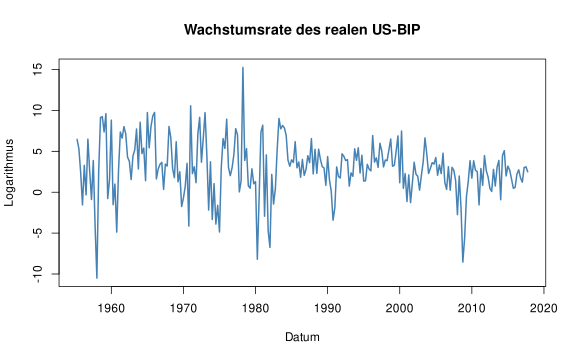

---

# Setup


``` r
# Optionen Rendering
knitr::opts_knit$set(root.dir = here::here())
knitr::opts_chunk$set(echo = TRUE,
                      message = FALSE,
                      warning = FALSE)

# Säubere Umgebung
rm(list=ls())

# Lade Pakete
library(here)
```

---

# Rohdaten

Die "Makrorohdaten" können auf der folgenden Internetseite gefunden werden: [Ausgewählte Ressourcen für Studierende – Stock und Watsons Einführung in die Ökonometrie, 4. Auflage (U.S.)](https://www.princeton.edu/~mwatson/Stock-Watson_4E/Stock-Watson-Resources-4e.html)

---

# Vorbereitung


``` r
source(here("00-session-kick-off", "02-code", "daten_vorbereitung.R"))
```

---

# Darstellung der Daten

Einlesen der Daten.


``` r
us_macro <- read.table(here("00-session-kick-off", "01-daten", "us_macro_quarterly_merged.csv"),
                       header = TRUE,
                       sep = ";"
)
```

Umwandlung in ein `ts` Object.


``` r
us_macro_ts <- ts(
  us_macro,
  frequency = 4,
  start = c(1950, 1),
  end = c(2026, 1)
)

us_macro_ts <- window(us_macro_ts,
                      start = c(1955, 1),
                      end = c(2017, 4)
)
```

Berechnung der annualisierten Wachstumsrate.


``` r
GDP <- us_macro_ts[,4]
GDPGrowth <- 400 * log(GDP/lag(GDP, -1))
```

Darstellung der Wachstumsrate.


``` r
plot(GDPGrowth,
     col = "steelblue",
     lwd = 2,
     ylab = "Logarithmus",
     xlab = "Datum",
     main = "Wachstumsrate des realen US-BIP")
```

<div class="figure" style="text-align: center">

<p class="caption">plot of chunk gdp_wachstum_grafik</p>
</div>

