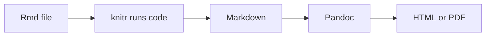

# *R* Office Hour – Reproducible Research with R Markdown  

---

## Table of Content

- [Table of Content](#table-of-content)
- [Learning goals](#learning-goals)
- [Introduction](#introduction)
  - [Why *R* Markdown?](#why-r-markdown)
  - [Setup](#setup)
  - [Creating an R Markdown file](#creating-an-r-markdown-file)
  - [Knitting](#knitting)
  - [Referencing other files (working directory problems)](#referencing-other-files-working-directory-problems)
- [Structure of an *R* Markdown document](#structure-of-an-r-markdown-document)
  - [1) YAML header](#1-yaml-header)
  - [2) Plain text](#2-plain-text)
  - [3) Code chunks](#3-code-chunks)
- [Basic Markdown formatting](#basic-markdown-formatting)
  - [Headings](#headings)
  - [Text formatting](#text-formatting)
  - [Lists](#lists)
- [Code chunk options (very important)](#code-chunk-options-very-important)
  - [`message = FALSE`](#message--false)
  - [`echo = FALSE`](#echo--false)
  - [`eval = FALSE`](#eval--false)
  - [`include = FALSE`](#include--false)
- [Output formats (change in YAML)](#output-formats-change-in-yaml)
  - [HTML (default)](#html-default)
  - [PDF](#pdf)
  - [Presentation](#presentation)
  - [Academic poster](#academic-poster)
- [Quarto (`.qmd`) - the modern successor to *R* Markdown](#quarto-qmd---the-modern-successor-to-r-markdown)
  - [Key idea](#key-idea)
  - [Main differences](#main-differences)
  - [For this course](#for-this-course)
- [Conclusion](#conclusion)
  - [Best practice](#best-practice)
  - [Key takeaways](#key-takeaways)
  - [Summary](#summary)

---

## Learning goals

Students should be able to:

- Use ***R* Markdown files** to combine:
  - text
  - code
  - output
  - formatting
- Create output documents such as:
  - HTML
  - PDF
  - presentations
  - posters

---

## Introduction

### Why *R* Markdown?

Without *R* Markdown:

- *R* scripts = mainly code
- limited documentation/comments
- results separate from explanation

With *R* Markdown:

- text + code in **one file**
- reproducible workflow
- easy sharing of analyses
- automatic report generation

---

### Setup

- Install package once:

```r
install.packages("rmarkdown")
```

- => No need to load the package manually.

---

### Creating an R Markdown file

In *RStudio*:

1. **File => New File => *R* Markdown**
2. Enter:
   - title
   - author
   - output type (choose HTML for now)
3. Click *OK*

You will see:

- YAML header (top)
- plain text area
- code chunks

---

### Knitting

Knitting = render document into final output.

What happens:

- runs all code chunks
- inserts results into document
- combines text + code + output

How:

- click **Knit** button

Result:

- opens generated file (e.g., HTML)

"Knitting" triggers the following pipeline.



Think of *R* Markdown as an *R* script that automatically produces a report.

**Important**:

- Knitting starts a NEW *R* session.
- Everything must run from top to bottom without relying on your Console.

For more information - in particular how to knit `.pdf` files - see: [Rendering Process](./260216-rendering-process.html)

---

### Referencing other files (working directory problems)

**Problem**

A common source of errors is that the working directory may differ between:

- running code interactively in the Console
- knitting an `.Rmd` file

Knitting starts a NEW clean *R* session. Everything is rerun from top to bottom, and objects from the Console do not exist.

**Goal**

Data files and scripts should be referenced in a way that works:

- during interactive work
- when knitting
- on different computers
- for other users

**Solution**

Recommended solution: Use an *RStudio* Project + `here()`

Use an *RStudio* Project (`.Rproj`) and the here package.

`here()` builds file paths relative to the project root (the folder containing the `.Rproj` file), which makes paths stable and reproducible.

This assumes your project is opened via the `.Rproj` file.

**Example**

Example project structure

```bash
.
├── 01-data
│   ├── 260219_prep_data.csv
│   └── 260219_raw_data.csv
├── 02-scripts
│   └── 260219_data_preparation.R
├── 03-reports
│   ├── 260219_report.html
│   ├── 260219_report.pdf
│   └── 260219_report.Rmd
├── some-project.Rproj
└── README.md
```

Using `here()`

```r
library(here)

here("01-data", "260219_prep_data.csv")
# Result (example): /path/to/project/01-data/260219_prep_data.csv

# Read data safely
read.table(
  here("01-data", "260219_prep_data.csv"),
  sep = ";",
  header = TRUE
)
```

Conclusion:

=> Avoid using `setwd()` in projects - always use `here()`!

---

## Structure of an *R* Markdown document

### 1) YAML header

- Metadata section between `---` lines
- Defines:
  - title
  - author
  - date
  - output format

Example:

```yaml
---
title: "My Document"
author: "Your Name"
output: html_document
---
```

---

### 2) Plain text

- Normal text = explanation, interpretation, comments
- Written directly in the document
- Not executed as *R* code

---

### 3) Code chunks

Used for executable code.

Structure:

````markdown
```{r chunk-name}
# R code
```
````

Key points:

- Start/end with three backticks
- `{r}` tells R Markdown to run *R* code
- optional:
  - chunk name
  - options

Run code by:

- green arrow button
- or when knitting

---

## Basic Markdown formatting

### Headings

```markdown
# Heading 1
## Heading 2
### Heading 3
```

---

### Text formatting

```markdown
*italics*
**bold**
```

---

### Lists

Unordered list:

```markdown
- item
- item
  - sub-item
```

Numbered list:

```markdown
1. item
2. item
```

---

## Code chunk options (very important)

Control what is shown in final document.

### `message = FALSE`

- run code
- hide messages/warnings

Use when:

- loading packages

````markdown
```{r, message=FALSE}
library(dplyr)
```
````

---

### `echo = FALSE`

- run code
- hide code
- show results only

Good for:

- clean reports
- plots

---

### `eval = FALSE`

- show code
- do NOT run it

Good for:

- teaching examples

---

### `include = FALSE`

- run code
- show nothing (no code, no output)

Good for:

- setup chunks
- global options

---

## Output formats (change in YAML)

### HTML (default)

```yaml
output: html_document
```

- interactive
- easy sharing
- good for most purposes

---

### PDF

```yaml
output: pdf_document
```

- printable
- publication style
- may require LaTeX installation

---

### Presentation

```yaml
output: beamer_presentation
```

- automatic slides
- useful for teaching

---

### Academic poster

```yaml
output:
  posterdown::posterdown_html
```

- requires package `posterdown`
- good for conference posters

---

## Quarto (`.qmd`) - the modern successor to *R* Markdown

You may encounter **Quarto** files (`.qmd`) instead of *R* Markdown files (`.Rmd`).  

Quarto is a newer publishing system built on the same core ideas (see: [link](https://quarto.org/))

---

### Key idea

If you understand *R* Markdown, you already understand most of Quarto.

Both systems use:

- Markdown text
- executable code chunks
- the same knitting/rendering pipeline (knitr + Pandoc)
- similar YAML headers

---

### Main differences

In general:

| *R* Markdown | Quarto |
|---|---|
| File extension: `.Rmd` | File extension: `.qmd` |
| Part of the `rmarkdown` package | Separate publishing system |
| R-focused | Multi-language (R, Python, Julia, etc.) |

In particular:

- [Definition of chunk options](https://quarto.org/docs/computations/r.html#chunk-options)
- [Definition of output formats](https://quarto.org/docs/computations/r.html#output-formats)

---

### For this course

- We focus on ***R* Markdown (`.Rmd`)**.
- The concepts you learn here transfer directly to Quarto later.
- If you can write an `.Rmd`, you can quickly learn `.qmd`.

---

## Conclusion

### Best practice

- Never rely on objects created in the console
- Never use setwd()
- Use here() inside projects
- Knit often

### Key takeaways

- R Markdown = **reproducibility**
- One source file => many outputs
- Code + explanation stay together
- Knitting = rerunning everything from scratch

---

### Summary

Students should now be able to:

- create and structure an R Markdown document
- mix text and code correctly
- use basic Markdown formatting
- control output with chunk options
- knit documents into different formats
