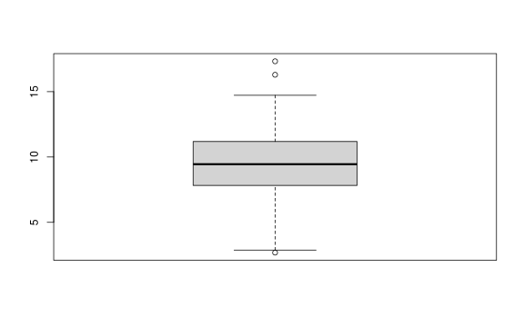
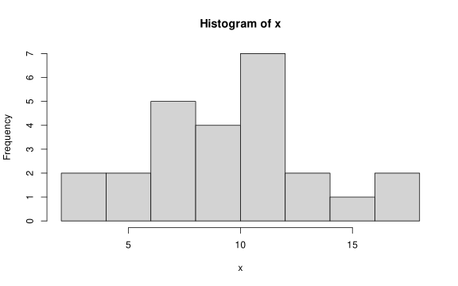
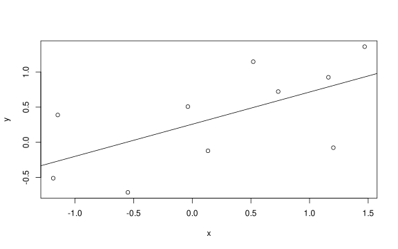
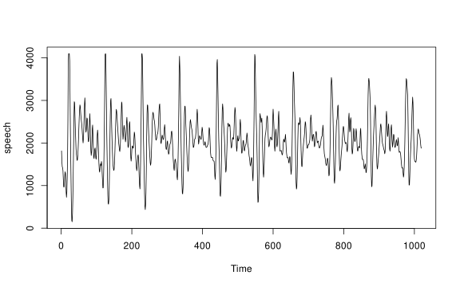
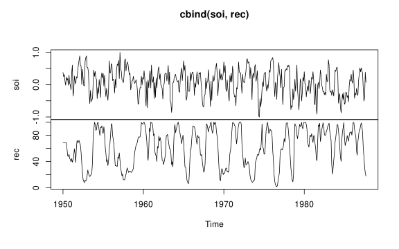
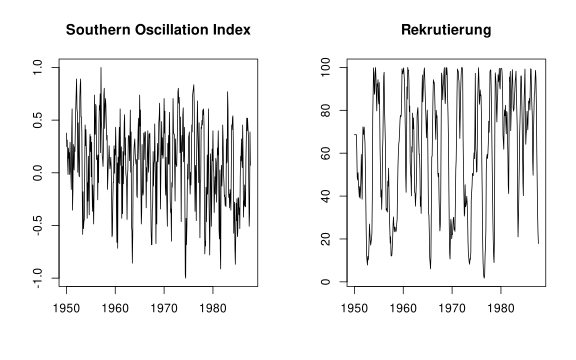
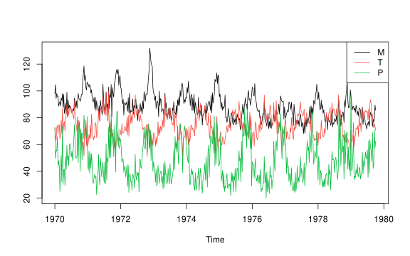

---

# Kurze Einführung in *R*

Dieses Dokument bietet eine kurze Einführung in die Statistiksoftware *R*.

---

## Setup


``` r
# Lade here Paket
library(here)

# Optionen Rendering
knitr::opts_knit$set(root.dir = here())
knitr::opts_chunk$set(echo = TRUE,
                      message = FALSE,
                      warning = FALSE,
                      fig.align = "center",
                      fig.height = 5,
                      fig.width = 8)

# Säubere Umgebung
rm(list=ls())

# Lade Packete
library(astsa)
library(dynlm)
```

---

## Grundlagen

* Shumway, R. H., Stoffer, D. S., & Stoffer, D. S. (2017). Zeitreihenanalyse und ihre Anwendungen (Bd. 4). New York: Springer.
* [GitHub Stoffer: R-Grundlagen](https://dsstoffer.github.io/Rtoot#basics)
* [CRAN: astsa: Angewandte statistische Zeitreihenanalyse](https://cran.r-project.org/web/packages/astsa/index.html)

---

### Einfache Berechnungen


``` r
2+2               # Addition
```

```
## [1] 4
```

``` r
5*5 + 2           # Multiplikation und Addition
```

```
## [1] 27
```

``` r
5/5 - 3           # Division und Subtraktion
```

```
## [1] -2
```

``` r
log(exp(pi))      # Logarithmus, Exponentialfunktion, pi
```

```
## [1] 3.141593
```

``` r
sin(pi/2)         # Sinusfunktion
```

```
## [1] 1
```

``` r
exp(1)^(-2)       # Potenz
```

```
## [1] 0.1353353
```

``` r
sqrt(8)           # Quadratwurzel
```

```
## [1] 2.828427
```

``` r
1:5               # Sequenzen
```

```
## [1] 1 2 3 4 5
```

``` r
seq(1, 10, by=2)  # Sequenzen
```

```
## [1] 1 3 5 7 9
```

``` r
rep(2, 3)         # Wiederhole 2 dreimal
```

```
## [1] 2 2 2
```

---

### Zuweisung und Objekte


``` r
x <- 1 + 2      # speichere 1 + 2 in Objekt x
x = 1 + 2       # gleich wie oben
1 + 2 -> x      # gleich
x               # zeige Objekt x an
```

```
## [1] 3
```

``` r
(y <- 9 * 3)     # speichere 9 mal 3 in y und zeige das Ergebnis
```

```
## [1] 27
```

``` r
(z <- rnorm(5))  # speichere 5 Standardnormalverteilungen in z und zeige z
```

```
## [1]  0.1381514  0.3586051 -0.3922516 -0.4081732  1.2555776
```


``` r
x <- c(1, 2, 3, 4); y <- 2*x; z <- c(10, 20); w <- c(8, 3, 2)
x * y     
```

```
## [1]  2  8 18 32
```

``` r
x + z     
```

```
## [1] 11 22 13 24
```

``` r
#x + w    # was würde hier passieren?
```


``` r
ls()                
```

```
## [1] "w" "x" "y" "z"
```

``` r
ls(pattern = "my")  
```

```
## character(0)
```

``` r
rm(dummy)           
rm(list=ls())       
# help.start()     
# data()           
# help(exp)        
# getwd()          
# setwd()          
# q()              
```

---

### Daten

*R* verfügt über verschiedene Datenobjekte, darunter:

- Vektoren
- Matrizen
- Listen
- Datenframe
- Zeitreihenobjekte (`ts`, `zoo`, `xts`)


``` r
x <- c(1, 2, 3, 4, 5) # Numerischer vektor
y <- matrix(1:9, nrow=3) # Matrix
z <- list(a = 1, b = "text", c = TRUE) # Liste
df <- data.frame(time = 1:5, value = rnorm(5)) # Datenframe
```


``` r
mydata <- c(1,2,3,2,1) 
mydata                      
```

```
## [1] 1 2 3 2 1
```

``` r
mydata[3]                   
```

```
## [1] 3
```

``` r
mydata[3:5]                 
```

```
## [1] 3 2 1
```

``` r
mydata[-(1:2)]              
```

```
## [1] 3 2 1
```

``` r
length(mydata)              
```

```
## [1] 5
```

``` r
dim(mydata)                 
```

```
## NULL
```

``` r
mydata <- as.matrix(mydata)  
dim(mydata)                 
```

```
## [1] 5 1
```


``` r
# Angenommen, "dummy.txt" existiert im Arbeitsverzeichnis
(dummy <- scan(here("00-session-kick-off", "01-daten", "dummy.txt")))
```

```
##  [1] 1 2 3 2 1 9 0 2 1 0
```

``` r
(dummy <- read.table(here("00-session-kick-off", "01-daten", "dummy.txt")))
```

```
##   V1 V2 V3 V4 V5
## 1  1  2  3  2  1
## 2  9  0  2  1  0
```

``` r
dummy$V2
```

```
## [1] 2 0
```

``` r
colnames(dummy) <- c("Hund", "Katze", "Ratte", "Schwein", "Mensch")
attach(dummy)
Katze
```

```
## [1] 2 0
```

``` r
Ratte*(Schwein - Mensch)
```

```
## [1] 3 2
```

``` r
head(dummy)
```

```
##   Hund Katze Ratte Schwein Mensch
## 1    1     2     3       2      1
## 2    9     0     2       1      0
```

``` r
detach(dummy)
```


``` r
# CSV mit Header lesen
(dummy <- read.csv(here("00-session-kick-off", "01-daten", "dummy.csv")))
```

```
##   Dog Cat Rat Pig Man
## 1   1   2   3   2   1
## 2   9   0   2   1   0
```


``` r
x = 1:3; y = 4:6
(u <- c(x, y))       
```

```
## [1] 1 2 3 4 5 6
```

``` r
(u1 <- cbind(x, y))  
```

```
##      x y
## [1,] 1 4
## [2,] 2 5
## [3,] 3 6
```

``` r
(u2 <- rbind(x ,y))  
```

```
##   [,1] [,2] [,3]
## x    1    2    3
## y    4    5    6
```

---

### Packete, Funktionen, bedingte Anweisungen und Schleifen

---

#### Packete

Installiere und lade Packete:


``` r
# install.packages("tidyverse") # nur einmal notwendig!
# library(tidyverse)
```

---

#### Funktionen

Funktionen werden mit `function` erstellt:

Funktionen 


``` r
my_function <- function(x) {
  return(x^2)
}
my_function(4)
```

```
## [1] 16
```

---

#### Bedingte Anweistungen


``` r
x <- 10
if (x > 5) {
  print("x is greater than 5")
} else {
  print("x is 5 or less")
}
```

```
## [1] "x is greater than 5"
```

``` r
for (i in 1:5) {
  print(i)
}
```

```
## [1] 1
## [1] 2
## [1] 3
## [1] 4
## [1] 5
```

---

#### Schleifen

Ein sehr geläufiger Schleifentyp sind for-Schleifen.


``` r
for (i in 1:5) {
  print(i)
}
```

```
## [1] 1
## [1] 2
## [1] 3
## [1] 4
## [1] 5
```

Ein weiterer Schleifentyp sind while-Schleifen.


``` r
i <- 1
while (i <= 5) {
  print(i)
  i <- i + 1
}
```

```
## [1] 1
## [1] 2
## [1] 3
## [1] 4
## [1] 5
```

Eine weitere Art von Schleifen bietet die Familie von apply Funktionen


``` r
lapply(1:5, function(a) {a + 1})
```

```
## [[1]]
## [1] 2
## 
## [[2]]
## [1] 3
## 
## [[3]]
## [1] 4
## 
## [[4]]
## [1] 5
## 
## [[5]]
## [1] 6
```

---

### Base R vs. Tidyverse

Base R verwendet einfache Funktionen, während Tidyverse eine unter anderem verkettbare Syntax bietet.


``` r
# Base R
df$time <- as.Date(df$time, origin="1970-01-01")

# # Tidyverse
# df <- df %>% mutate(time = as.Date(time, origin="1970-01-01"))
```

---

### Einfache Simulationen


``` r
set.seed(90210)                         
x <- rnorm(25, 10, 4)                   
c( mean(x), median(x), var(x), sd(x) )  
```

```
## [1]  9.473883  9.448511 13.926701  3.731850
```

``` r
c( min(x), max(x) )                     
```

```
## [1]  2.678173 17.326089
```

``` r
which.max(x)                            
```

```
## [1] 25
```

``` r
summary(x)                              
```

```
##    Min. 1st Qu.  Median    Mean 3rd Qu.    Max. 
##   2.678   7.824   9.449   9.474  11.185  17.326
```

``` r
boxplot(x); hist(x); stem(x)            
```

<div class="figure" style="text-align: center">

<p class="caption">plot of chunk simulation</p>
</div><div class="figure" style="text-align: center">

<p class="caption">plot of chunk simulation</p>
</div>

```
## 
##   The decimal point is 1 digit(s) to the right of the |
## 
##   0 | 334
##   0 | 5778888899
##   1 | 000111234
##   1 | 567
```

---

## Einführung in Zeitreihen

---

### Zeitreihenobjekt


``` r
(mydata <- c(1,2,3,2,1))                              
```

```
## [1] 1 2 3 2 1
```

``` r
(mydata <- as.ts(mydata))                             
```

```
## Time Series:
## Start = 1 
## End = 5 
## Frequency = 1 
## [1] 1 2 3 2 1
```

``` r
(mydata <- ts(mydata, start=1950))                    
```

```
## Time Series:
## Start = 1950 
## End = 1954 
## Frequency = 1 
## [1] 1 2 3 2 1
```

``` r
(mydata <- ts(mydata, start=c(1950,3), frequency=4))  
```

```
##      Qtr1 Qtr2 Qtr3 Qtr4
## 1950              1    2
## 1951    3    2    1
```

``` r
time(mydata)                                          
```

```
##         Qtr1    Qtr2    Qtr3    Qtr4
## 1950                 1950.50 1950.75
## 1951 1951.00 1951.25 1951.50
```

``` r
(x <- window(mydata, start=c(1951,1), end=c(1951,3))) 
```

```
##      Qtr1 Qtr2 Qtr3
## 1951    3    2    1
```

Hinweis: `ts`-Objekte sind nützlich für Zeitreihen mit regelmäßigen Intervallen (z.B. `frequency=4` für Quartalsdaten), aber nicht für tägliche Daten geeignet.

---

### Verzögerung und Differenzen


``` r
(x <- ts(1:5))                        
```

```
## Time Series:
## Start = 1 
## End = 5 
## Frequency = 1 
## [1] 1 2 3 4 5
```

``` r
cbind(x, stats::lag(x), stats::lag(x,-1))           
```

```
## Time Series:
## Start = 0 
## End = 6 
## Frequency = 1 
##    x stats::lag(x) stats::lag(x, -1)
## 0 NA             1                NA
## 1  1             2                NA
## 2  2             3                 1
## 3  3             4                 2
## 4  4             5                 3
## 5  5            NA                 4
## 6 NA            NA                 5
```

``` r
ts.intersect(x, stats::lag(x,1), stats::lag(x,-1))  
```

```
## Time Series:
## Start = 2 
## End = 4 
## Frequency = 1 
##   x stats::lag(x, 1) stats::lag(x, -1)
## 2 2                3                 1
## 3 3                4                 2
## 4 4                5                 3
```

``` r
diff(x)                               
```

```
## Time Series:
## Start = 2 
## End = 5 
## Frequency = 1 
## [1] 1 1 1 1
```

``` r
diff(x, 2)                            
```

```
## Time Series:
## Start = 3 
## End = 5 
## Frequency = 1 
## [1] 2 2 2
```

``` r
diff(diff(x))                         
```

```
## Time Series:
## Start = 3 
## End = 5 
## Frequency = 1 
## [1] 0 0 0
```

``` r
diff(x, diff=2)                       
```

```
## Time Series:
## Start = 3 
## End = 5 
## Frequency = 1 
## [1] 0 0 0
```

---

### Regressionen


``` r
set.seed(1999)          
(x <- rnorm(10))        
```

```
##  [1]  0.73267249 -0.03782971  1.20300914  1.46980203  0.13369030  0.51982725 -0.54938203
##  [8] -1.18560796 -1.14727975  1.16074200
```

``` r
(y <- x + rnorm(10))    
```

```
##  [1]  0.7217868  0.5075593 -0.0768911  1.3607217 -0.1214286  1.1468035 -0.7126184
##  [8] -0.5109490  0.3886331  0.9251048
```

``` r
summary(fit <- lm(y~x)) 
```

```
## 
## Call:
## lm(formula = y ~ x)
## 
## Residuals:
##     Min      1Q  Median      3Q     Max 
## -0.8851 -0.3867  0.1325  0.3896  0.6561 
## 
## Coefficients:
##             Estimate Std. Error t value Pr(>|t|)  
## (Intercept)   0.2576     0.1892   1.362   0.2104  
## x             0.4577     0.2016   2.270   0.0529 .
## ---
## Signif. codes:  0 '***' 0.001 '**' 0.01 '*' 0.05 '.' 0.1 ' ' 1
## 
## Residual standard error: 0.58 on 8 degrees of freedom
## Multiple R-squared:  0.3918,	Adjusted R-squared:  0.3157 
## F-statistic: 5.153 on 1 and 8 DF,  p-value: 0.05289
```

``` r
plot(x, y)              
abline(fit)             
```

<div class="figure" style="text-align: center">

<p class="caption">plot of chunk regression</p>
</div>


``` r
resid(fit)                    
```

```
##          1          2          3          4          5          6          7          8 
##  0.1288372  0.2672500 -0.8851025  0.4304056 -0.4402385  0.6512681 -0.7188025 -0.2259478 
##          9         10 
##  0.6560924  0.1362381
```

``` r
fitted(fit)                   
```

```
##            1            2            3            4            5            6 
##  0.592949606  0.240309304  0.808211365  0.930316045  0.318809880  0.495535464 
##            7            8            9           10 
##  0.006184128 -0.285001160 -0.267459264  0.788866713
```

``` r
summary(fit <- lm(y ~ 0 + x))
```

```
## 
## Call:
## lm(formula = y ~ 0 + x)
## 
## Residuals:
##     Min      1Q  Median      3Q     Max 
## -0.7084 -0.1158  0.3265  0.5737  0.9909 
## 
## Coefficients:
##   Estimate Std. Error t value Pr(>|t|)  
## x   0.5250     0.2045   2.567   0.0304 *
## ---
## Signif. codes:  0 '***' 0.001 '**' 0.01 '*' 0.05 '.' 0.1 ' ' 1
## 
## Residual standard error: 0.6069 on 9 degrees of freedom
## Multiple R-squared:  0.4226,	Adjusted R-squared:  0.3585 
## F-statistic: 6.587 on 1 and 9 DF,  p-value: 0.03036
```


``` r
library(astsa)
ded <- ts.intersect(cmort, part, part4=stats::lag(part,-4))
summary(fit <- lm(cmort~part+part4, data=ded, na.action=NULL))
```

```
## 
## Call:
## lm(formula = cmort ~ part + part4, data = ded, na.action = NULL)
## 
## Residuals:
##     Min      1Q  Median      3Q     Max 
## -22.743  -5.368  -0.414   5.269  37.854 
## 
## Coefficients:
##             Estimate Std. Error t value Pr(>|t|)    
## (Intercept) 69.01020    1.37498  50.190  < 2e-16 ***
## part         0.15140    0.02898   5.225 2.56e-07 ***
## part4        0.26297    0.02899   9.071  < 2e-16 ***
## ---
## Signif. codes:  0 '***' 0.001 '**' 0.01 '*' 0.05 '.' 0.1 ' ' 1
## 
## Residual standard error: 8.323 on 501 degrees of freedom
## Multiple R-squared:  0.3091,	Adjusted R-squared:  0.3063 
## F-statistic: 112.1 on 2 and 501 DF,  p-value: < 2.2e-16
```

``` r
library(dynlm)
fit = dynlm(cmort~part + L(part,4))                             
summary(fit)
```

```
## 
## Time series regression with "ts" data:
## Start = 1970(5), End = 1979(40)
## 
## Call:
## dynlm(formula = cmort ~ part + L(part, 4))
## 
## Residuals:
##     Min      1Q  Median      3Q     Max 
## -22.743  -5.368  -0.414   5.269  37.854 
## 
## Coefficients:
##             Estimate Std. Error t value Pr(>|t|)    
## (Intercept) 69.01020    1.37498  50.190  < 2e-16 ***
## part         0.15140    0.02898   5.225 2.56e-07 ***
## L(part, 4)   0.26297    0.02899   9.071  < 2e-16 ***
## ---
## Signif. codes:  0 '***' 0.001 '**' 0.01 '*' 0.05 '.' 0.1 ' ' 1
## 
## Residual standard error: 8.323 on 501 degrees of freedom
## Multiple R-squared:  0.3091,	Adjusted R-squared:  0.3063 
## F-statistic: 112.1 on 2 and 501 DF,  p-value: < 2.2e-16
```

---

## Grafiken

---

### Einzelne Zeitreihe plotten


``` r
par(mfrow = c(1,1))
plot(speech)
```

<div class="figure" style="text-align: center">

<p class="caption">plot of chunk speech</p>
</div>

---

### Mehrere Zeitreihen plotten


``` r
plot.ts(cbind(soi, rec))
```

<div class="figure" style="text-align: center">

<p class="caption">plot of chunk plots</p>
</div>

``` r
par(mfrow = c(2,1))
plot(soi, ylab='', xlab='', main='Southern Oscillation Index')
plot(rec, ylab='', xlab='', main='Rekrutierung')
```

<div class="figure" style="text-align: center">

<p class="caption">plot of chunk plots</p>
</div>


``` r
ts.plot(cmort, tempr, part, col=1:3)
legend('topright', legend=c('M','T','P'), lty=1, col=1:3)
```

<div class="figure" style="text-align: center">

<p class="caption">plot of chunk ts_plot</p>
</div>

---

### Plots exportieren


``` r
dev.new(width=7, height=4)                
par(mar=c(3,3,1,1), mgp=c(1.6,.6,0) )     
plot(speech, type='n')
grid(lty=1, col=gray(.9)); lines(speech)
dev.off()
```

```
## RStudioGD 
##         2
```

``` r
pdf(file=here("00-session-kick-off", "03-ergebnisse", "speech.pdf"), width=7, height=4)
par(mar=c(3,3,1,1), mgp=c(1.6,.6,0) )     
plot(speech, type='n')
grid(lty=1, col=gray(.9)); lines(speech)
dev.off()
```

```
## RStudioGD 
##         2
```
