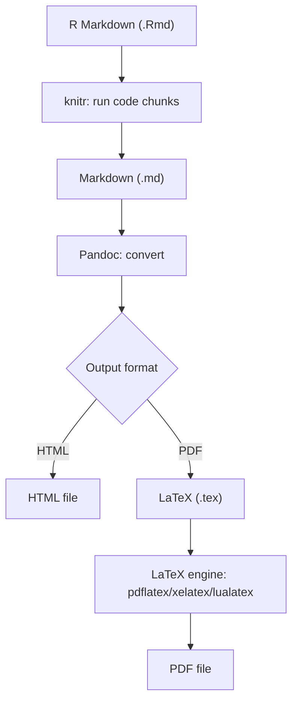
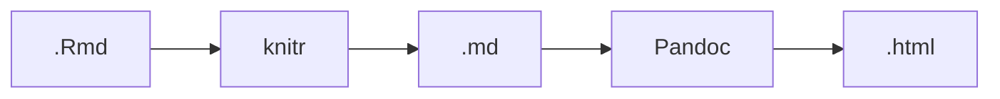
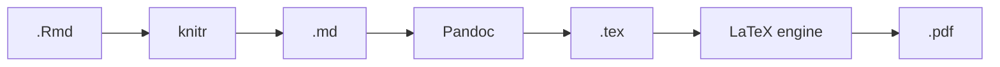
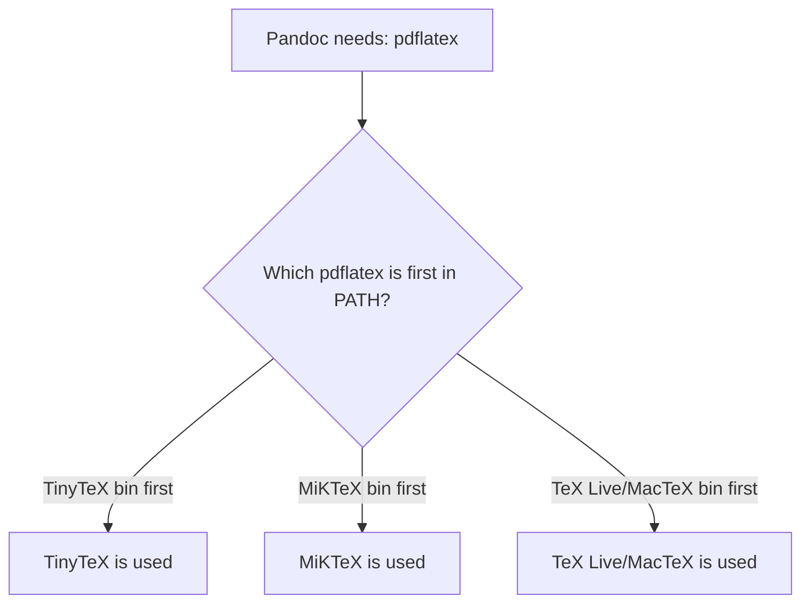

# R Markdown PDF/HTML Rendering Guide (TinyTeX-focused)

---

## Purpose

This guide explains:

- how to set up **TinyTeX** as a reliable PDF backend for R Markdown
- how rendering works internally for **HTML** and **PDF**
- how to diagnose and control which TeX distribution is used
- best practices for teaching environments (Windows / macOS / Linux)

---

## Outline

- [Purpose](#purpose)
- [Outline](#outline)
- [Mental model: What happens when you knit?](#mental-model-what-happens-when-you-knit)
  - [Rendering pipeline (high level)](#rendering-pipeline-high-level)
  - [HTML rendering](#html-rendering)
  - [PDF rendering](#pdf-rendering)
- [Why TinyTeX (for PDF rendering)?](#why-tinytex-for-pdf-rendering)
- [Fresh setup (recommended workflow)](#fresh-setup-recommended-workflow)
  - [1) Install the R package](#1-install-the-r-package)
  - [2) Install TinyTeX itself](#2-install-tinytex-itself)
  - [3) Restart RStudio](#3-restart-rstudio)
  - [4) Verify installation](#4-verify-installation)
- [How R Markdown chooses a TeX distribution](#how-r-markdown-chooses-a-tex-distribution)
- [Check which distribution is currently used](#check-which-distribution-is-currently-used)
- [Make TinyTeX the default for RStudio](#make-tinytex-the-default-for-rstudio)
- [Summary](#summary)


## Mental model: What happens when you knit?

### Rendering pipeline (high level)



### HTML rendering

- **No LaTeX required**
- Most robust default for teaching



### PDF rendering

- Requires a TeX distribution (TinyTeX / TeX Live / MacTeX / MiKTeX)
- Pandoc calls a **PDF engine** (default typically `pdflatex`)



---

## Why TinyTeX (for PDF rendering)?

TinyTeX is:

- a lightweight TeX Live distribution
- installed in user space (often no admin rights needed)
- well integrated with R Markdown
- easier to standardize across Windows/macOS/Linux

**Advantage:** fewer “mystery TeX” issues when everyone uses the same stack.

---

## Fresh setup (recommended workflow)

### 1) Install the R package

```r
install.packages("tinytex")
```

### 2) Install TinyTeX itself

```r
tinytex::install_tinytex()
```

### 3) Restart RStudio

PATH changes often require a restart (especially on Windows, sometimes on Linux).

### 4) Verify installation

```r
tinytex::is_tinytex()
Sys.which(c("pdflatex","xelatex","latexmk"))
```

Expected:

- `tinytex::is_tinytex()` => `TRUE`
- `pdflatex` (and/or `latexmk`) path is **not empty**

---

## How R Markdown chooses a TeX distribution

R Markdown does **not** choose “TinyTeX vs MiKTeX vs TeX Live” directly.

Instead:

1. Pandoc is instructed to use a PDF engine (e.g., `pdflatex`)
2. The OS resolves that command using PATH
3. The **first match in PATH** is used



So: **Control PATH => control which TeX distribution renders your PDFs.**

---

## Check which distribution is currently used

```r
Sys.which(c("pdflatex","tlmgr"))
```

Examples:

- MiKTeX (Windows): `...MiKTeX...\pdflatex.exe`
- TinyTeX: `...TinyTeX...\bin\windows\pdflatex.exe`

---

## Make TinyTeX the default for RStudio

**Recommended**: `.Renviron` (R-only default)

**Step 1 - Find your TinyTeX installation path (inside R)**

```r
tinytex::tinytex_root()
```

**Step 2 - Open `.Renviron`**

```r
file.edit("~/.Renviron")
```

Add a PATH entry that points to the TinyTeX bin folder for your OS.

*Typical location*:

- Windows:
  - `C:/Users/YOURNAME/AppData/Roaming/TinyTeX`
  - => Add `PATH=C:\\Users\\YOURNAME\\AppData\\Roaming\\TinyTeX\\bin\\windows;${PATH}`
- macOS
  - `~/Library/TinyTeX`
  - => Add `PATH=~/Library/TinyTeX/bin/universal-darwin:${PATH}`
- Linux
  - `~/.TinyTeX`
  - => Add `PATH=~/.TinyTeX/bin/x86_64-linux:${PATH}`

**Step 3 - Restart RStudio**

PATH changes only take effect after restarting.

**Step 4 - Verify (inside R)**

```r
Sys.which("pdflatex")
tinytex::is_tinytex()
```

---

## Summary

- HTML output needs **no LaTeX**.
- PDF output requires a **TeX distribution**.
- TinyTeX is lightweight and consistent across OS.
- The TeX distribution used is determined by **PATH precedence**.
- `Sys.which("pdflatex")` tells you what will actually be used.
