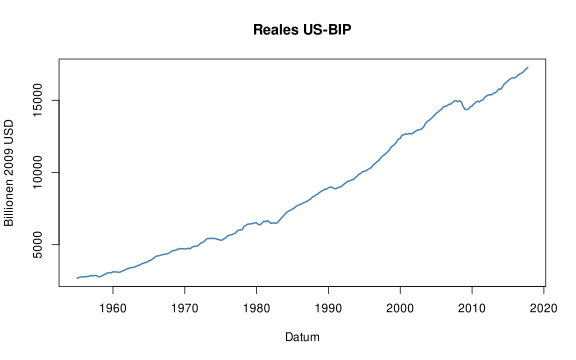
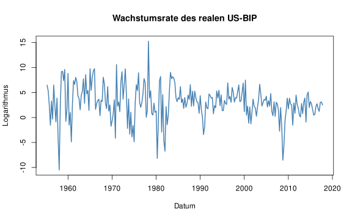
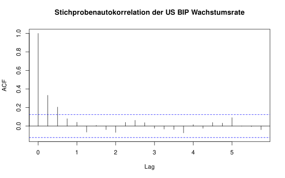
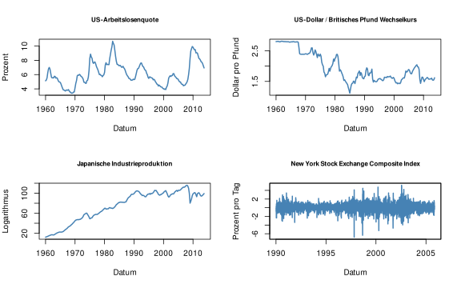
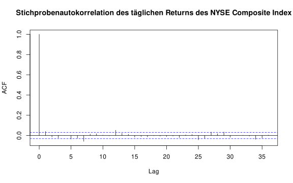

---

# Kapitel 1) Einführung in die Zeitreihenregression und -prognose

---

## Setup


``` r
# Lade here Paket
library(here)

# Optionen Rendering
knitr::opts_knit$set(root.dir = here())
knitr::opts_chunk$set(echo = TRUE,
                      message = FALSE,
                      warning = FALSE,
                      fig.align = "center",
                      fig.cap = "",
                      fig.height = 5,
                      fig.width = 8)

# Säubere Umgebung
rm(list=ls())

# Lade Packete
library(AER)
library(readxl)
```

## Kapitel 1.1) Einführung in Zeitreihendaten

---

### Verwendung von Regressionsmodellen zur Prognose

---

#### Frage 1

Was ist der Unterschied zwischen der Schätzung von Modellen zur Analyse von kausalen Effekten und zur Prognose?

...

...

...

...

...

---

Nehmen Sie ein einfaches Beispiel zur Schätzung des kausalen Effekts des Schüler-Lehrer-Verhältnisses auf Testergebnisse unter Verwendung eines einfachen Regressionsmodellsn aus dem Textbuch S&W 2020. Verwenden Sie `help("CASchools")`, für mehr Informationen über den Datensatz.


``` r
data(CASchools)   
CASchools$STR <- CASchools$students/CASchools$teachers       
CASchools$score <- (CASchools$read + CASchools$math)/2

mod <- lm(score ~ STR, data = CASchools)

coeftest(mod, vcov. = vcovHC, type = "HC1")
```

```
## 
## t test of coefficients:
## 
##              Estimate Std. Error t value  Pr(>|t|)    
## (Intercept) 698.93295   10.36436 67.4362 < 2.2e-16 ***
## STR          -2.27981    0.51949 -4.3886 1.447e-05 ***
## ---
## Signif. codes:  0 '***' 0.001 '**' 0.01 '*' 0.05 '.' 0.1 ' ' 1
```

---

#### Frage 2

Hat die Schätzung des Koeffizienten für das Schüler-Lehrer-Verhältnis eine kausale Interpretation?

Hinweis: Die Einbeziehung des Anteils der englischsprachigen Schüler ergibt folgenden geschätzten Effekt des Schüler-Lehrer-Verhältnisses:


``` r
mult_mod <- lm(score ~ STR + english, data = CASchools)

coeftest(mult_mod, vcov. = vcovHC, type = "HC1")
```

```
## 
## t test of coefficients:
## 
##               Estimate Std. Error  t value Pr(>|t|)    
## (Intercept) 686.032245   8.728225  78.5993  < 2e-16 ***
## STR          -1.101296   0.432847  -2.5443  0.01131 *  
## english      -0.649777   0.031032 -20.9391  < 2e-16 ***
## ---
## Signif. codes:  0 '***' 0.001 '**' 0.01 '*' 0.05 '.' 0.1 ' ' 1
```

...

...

...

...

...

---

Bei der Entscheidung, auf welche Schule ihr Kind gehen soll, könnte es für eine Mutter dennoch sinnvoll sein, `mod` zur Prognose der Testergebnisse in Schulbezirken zu verwenden, für die keine öffentlichen Daten zu den Ergebnissen verfügbar sind.

---

#### Frage 3

Ist das einfache Regressionsmodell nützlich zur Prognose von Testergebnissen in Schulbezirken ohne öffentliche Daten zu Testergebnissen?

Beispiel: Angenommen, die durchschnittliche Klasse in einem Bezirk hat $25$ Schüler.


``` r
predict(mod, newdata = data.frame("STR" = 25))
```

```
##        1 
## 641.9377
```

...

...

...

...

...

---

#### Frage 4

Welche zusätzlichen Informationen könnten in einem Zeitreihenkontext zur Prognose von Testergebnissen genutzt werden?

...

...

...

...

...

---

### US-Reales BIP

Das BIP wird als der Gesamtwert aller in einem bestimmten Zeitraum produzierten Waren und Dienstleistungen definiert. Der Datensatz `us_macro_quarterly.xlsx` enthält vierteljährliche Daten zum realen BIP der USA (d.h. inflationsbereinigt) von 1947 bis 2004.

Ein guter Ausgangspunkt ist die grafische Darstellung der Daten.

Einlesen der Daten.


``` r
us_macro <- read.table(here("01-session-01-01-einfuehrung", "01-daten", "us_macro_quarterly_merged.csv"),
                       header = TRUE,
                       sep = ";"
)
```

Umwandlung in ein `ts` Object.


``` r
us_macro_ts <- ts(
  us_macro,
  frequency = 4,
  start = c(1950, 1),
  end = c(2026, 1)
)

us_macro_ts <- window(us_macro_ts,
                      start = c(1955, 1),
                      end = c(2017, 4)
)
```

Berechnung der annualisierten Wachstumsrate.


``` r
GDP <- us_macro_ts[,"GDPC1"]
GDPGrowth <- 400 * log(GDP/lag(GDP, -1))
```

Darstellung des realen US-BIP.


``` r
plot(GDP,
     col = "steelblue",
     lwd = 2,
     ylab = "Billionen 2009 USD",
     xlab = "Datum",
     main = "Reales US-BIP")
```



Darstellung der Wachstumsrate.


``` r
plot(GDPGrowth,
     col = "steelblue",
     lwd = 2,
     ylab = "Logarithmus",
     xlab = "Datum",
     main = "Wachstumsrate des realen US-BIP")
```



---

#### Frage 5

Welche Eigenschaften weisen die BIP-Zeitreihendaten auf? Warum ist die Transformation zur Wachstumsrate sinnvoll?

...

...

...

...

...

---

### Autokorrelation

Beobachtungen einer Zeitreihe sind typischerweise korreliert. Diese Art von Korrelation nennt man *Autokorrelation* oder *serielle Korrelation*.


``` r
acf(GDPGrowth, lag.max = 10, plot = F)
```

```
## 
## Autocorrelations of series 'GDPGrowth', by lag
## 
##   0.00   0.25   0.50   0.75   1.00   1.25   1.50   1.75   2.00   2.25   2.50 
##  1.000  0.332  0.205  0.080  0.041 -0.065  0.007 -0.039 -0.069  0.040  0.062
```


``` r
acf(GDPGrowth, , main = "Stichprobenautokorrelation der US BIP Wachstumsrate")
```



---

#### Frage 6

Welche Schlussfolgerungen lassen sich aus den Ergebnissen ziehen?

...

...

...

...

...

---

### Weitere Beispiele wirtschaftlicher Zeitreihen

Makro Zeitreihen


``` r
us_macro_ts <- window(us_macro_ts,
                      start = c(1960, 1),
                      end = c(2013, 4)
)

GDP <- us_macro_ts[,"GDPC1"]
USUnemp <- us_macro_ts[,"UNRATE"]
DollarPoundFX <- us_macro_ts[,"EXUSUK"]
JPIndProd <- us_macro_ts[,"JAPAN_IP"]
```

Finanzmarkt Zeitreihe


``` r
# Daily NYSE Composite Index
data("NYSESW")

# Berechne Returns
NYSEIndexRet <- 100 * diff(log(NYSESW))
```

Darstellung


``` r
par(mfrow = c(2, 2))
plot(USUnemp, col = "steelblue", lwd = 2, ylab = "Prozent", xlab = "Datum", main = "US-Arbeitslosenquote", cex.main = 0.8)
plot(DollarPoundFX, col = "steelblue", lwd = 2, ylab = "Dollar pro Pfund", xlab = "Datum", main = "US-Dollar / Britisches Pfund Wechselkurs", cex.main = 0.8)
plot(JPIndProd, col = "steelblue", lwd = 2, ylab = "Logarithmus", xlab = "Datum", main = "Japanische Industrieproduktion", cex.main = 0.8)
plot(NYSEIndexRet, col = "steelblue", lwd = 2, ylab = "Prozent pro Tag", xlab = "Datum", main = "New York Stock Exchange Composite Index", cex.main = 0.8)
```



---

#### Frage 7

Beschreiben und vergleichen Sie die Eigenschaften dieser verschiedenen wirtschaftlichen Zeitreihen.

...

...

...

...

...

---

Zur genaueren Analyse der täglichen Veränderungen des New York Stock Exchange Composite Index berechnen wir die Stichprobenautokorrelationen.


``` r
acf(as.numeric(NYSEIndexRet), plot = F, lag.max = 10)
```

```
## 
## Autocorrelations of series 'as.numeric(NYSEIndexRet)', by lag
## 
##      0      1      2      3      4      5      6      7      8      9     10 
##  1.000  0.041 -0.015 -0.023  0.000 -0.036 -0.027 -0.058  0.013  0.017  0.004
```


``` r
par(mfrow = c(1, 1))
acf(as.numeric(NYSEIndexRet), main = "Stichprobenautokorrelation des täglichen Returns des NYSE Composite Index")
```



---

#### Frage 8

Beschreiben Sie die Eigenschaften des New York Stock Exchange Composite Index genauer.

...

...

...

...

...
