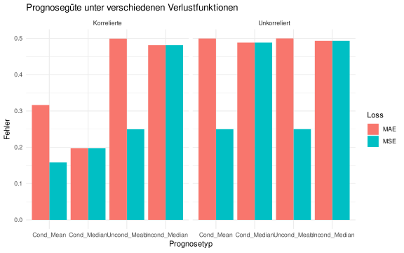

---

# Prognosen und Verlustfunktionen: Bedingter Mittelwert vs. Median

Dieses Dokument zeigt, wie die **Wahl der Verlustfunktion** bestimmt, welche Prognose optimal (Oracle-Prognose) ist.

Wir vergleichen:

- **Bedingter Mittelwert** - optimal unter **quadratischem Verlust** (MSE)
- **Bedingter Median** - optimal unter **absolutem Verlust** (MAE)

für zwei Arten von Münzwürfen:

- **Unkorrelierte** (IID) Würfe
- **Korrelierte** Würfe (Markov-Prozess)

---

## Setup


``` r
# Lade here Paket
library(here)

# Optionen Rendering
knitr::opts_knit$set(root.dir = here())
knitr::opts_chunk$set(echo = TRUE,
                      message = FALSE,
                      warning = FALSE,
                      fig.align = "center",
                      fig.cap = "",
                      fig.height = 5,
                      fig.width = 8)

# Säubere Umgebung
rm(list=ls())

# Verwende "seed" für die Reproduzierbarkeit
set.seed(123)
```

---

## Simulation der Münzwürfe


``` r
n <- 1000

# Unkorrelierte Würfe
fair_flips <- rbinom(n, 1, 0.5)

# Korrelierte Würfe
correlated_flips <- numeric(n)
correlated_flips[1] <- rbinom(1, 1, 0.5)
p_stay <- 0.8

for (i in 2:n) {
  correlated_flips[i] <- ifelse(runif(1) < p_stay, correlated_flips[i-1], 1 - correlated_flips[i-1])
}
```

---

## Prognosefunktionen


``` r
compute_forecast_errors <- function(flips) {
  y_actual <- flips[-1]
  y_lagged <- flips[-length(flips)]

  # Bedingter Mittelwert (empirisch geschätzt)
  prob_1_given_1 <- mean(y_actual[y_lagged == 1])
  prob_1_given_0 <- mean(y_actual[y_lagged == 0])

  cond_mean_forecast <- ifelse(y_lagged == 1, prob_1_given_1, prob_1_given_0)
  cond_median_forecast <- ifelse(cond_mean_forecast >= 0.5, 1, 0)

  # Unbedingte Varianten
  prob_1_uncond <- mean(y_lagged)
  uncond_mean_forecast <- rep(prob_1_uncond, length(y_actual))
  uncond_median_forecast <- ifelse(prob_1_uncond >= 0.5, 1, 0)

  mse <- function(a, f) mean((a - f)^2)
  mae <- function(a, f) mean(abs(a - f))

  data.frame(
    Forecast = c("Uncond_Mean", "Cond_Mean", "Uncond_Median", "Cond_Median"),
    MSE = c(mse(y_actual, uncond_mean_forecast),
            mse(y_actual, cond_mean_forecast),
            mse(y_actual, uncond_median_forecast),
            mse(y_actual, cond_median_forecast)),
    MAE = c(mae(y_actual, uncond_mean_forecast),
            mae(y_actual, cond_mean_forecast),
            mae(y_actual, uncond_median_forecast),
            mae(y_actual, cond_median_forecast))
  )
}

errors_fair <- compute_forecast_errors(fair_flips)
errors_corr <- compute_forecast_errors(correlated_flips)

errors_fair$Scenario <- "Unkorreliert"
errors_corr$Scenario <- "Korrelierte"
library(dplyr)
results <- bind_rows(errors_fair, errors_corr)
```

---

## Ergebnisse


``` r
library(tidyr)
results_long <- pivot_longer(results, cols = c(MSE, MAE), names_to = "Loss", values_to = "Error")

results_long
```

```
## # A tibble: 16 × 4
##    Forecast      Scenario     Loss  Error
##    <chr>         <chr>        <chr> <dbl>
##  1 Uncond_Mean   Unkorreliert MSE   0.250
##  2 Uncond_Mean   Unkorreliert MAE   0.500
##  3 Cond_Mean     Unkorreliert MSE   0.250
##  4 Cond_Mean     Unkorreliert MAE   0.500
##  5 Uncond_Median Unkorreliert MSE   0.493
##  6 Uncond_Median Unkorreliert MAE   0.493
##  7 Cond_Median   Unkorreliert MSE   0.488
##  8 Cond_Median   Unkorreliert MAE   0.488
##  9 Uncond_Mean   Korrelierte  MSE   0.250
## 10 Uncond_Mean   Korrelierte  MAE   0.499
## 11 Cond_Mean     Korrelierte  MSE   0.158
## 12 Cond_Mean     Korrelierte  MAE   0.317
## 13 Uncond_Median Korrelierte  MSE   0.481
## 14 Uncond_Median Korrelierte  MAE   0.481
## 15 Cond_Median   Korrelierte  MSE   0.197
## 16 Cond_Median   Korrelierte  MAE   0.197
```

---

## Visualisierung


``` r
library(ggplot2)
ggplot(results_long, aes(x = Forecast, y = Error, fill = Loss)) +
  geom_bar(stat = "identity", position = "dodge") +
  facet_wrap(~Scenario) +
  labs(title = "Prognosegüte unter verschiedenen Verlustfunktionen",
       y = "Fehler", x = "Prognosetyp") +
  theme_minimal()
```



---

## Fazit

- Der **bedingte Mittelwert** minimiert den **MSE** (quadratischer Verlust).
- Der **bedingte Median** minimiert den **MAE** (absoluter Verlust).
- Die Wahl der **Verlustfunktion bestimmt, was eine gute Prognose ist**.
