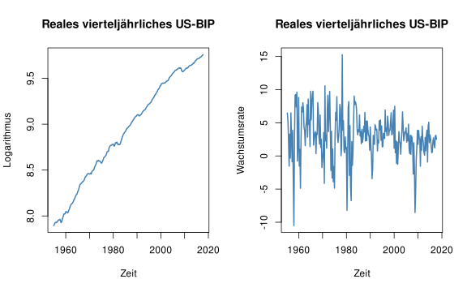

---

# Session 3) Autoregression und das Autoregressive (AR) Modell

Dieses Dokument enthält den Praxis-Teil von Session 3) Autoregression und das Autoregressive (AR) Modell. 

---

## Setup


``` r
# Lade here Paket
library(here)

# Optionen Rendering
knitr::opts_knit$set(root.dir = here())
knitr::opts_chunk$set(echo = TRUE,
                      message = FALSE,
                      warning = FALSE,
                      fig.align = "center",
                      fig.cap = "",
                      fig.height = 5,
                      fig.width = 8)

# Säubere Umgebung
rm(list=ls())

# Lade Packete
library(zoo)
library(dynlm)
library(sandwich)
library(lmtest)
```

---

## Datenaufbereitung

Einlesen der Daten.


``` r
us_macro <- read.table(here("01-session-01-01-einfuehrung", "01-daten", "us_macro_quarterly_merged.csv"),
                       header = TRUE,
                       sep = ";"
)
```

Umwandlung in ein `ts` Object.


``` r
us_macro_ts <- ts(
  us_macro,
  frequency = 4,
  start = c(1950, 1),
  end = c(2026, 1)
)

us_macro_ts <- window(us_macro_ts,
                      start = c(1955, 1),
                      end = c(2017, 4)
)
```

Berechnung der annualisierten Wachstumsrate.


``` r
GDP <- us_macro_ts[,"GDPC1"]
GDPGR <- 400 * log(GDP/lag(GDP, -1))
```

```
## Error in `lag()`:
## ! `x` must be a vector, not a <ts>, do you want `stats::lag()`?
```

Anbindung der annualisierten Wachstumsrate an `us_macro_ts`.


``` r
# An
us_macro_ts <- cbind(us_macro_ts, GDPGR)
```

```
## Error:
## ! object 'GDPGR' not found
```

``` r
colnames(us_macro_ts) <- sub(".*\\.", "", colnames(us_macro_ts))
```

---

### Frage 1

Welche Schritte umfasst die Aufbereitung der Daten?

...

...

...

...

...

---

## Darstellung der US BIP Daten


``` r
# Darstellung der BIP Variablen
par(mfrow = c(1,2))
plot(log(na.omit(us_macro_ts[,'GDPC1'])),
     col = "steelblue",
     lwd = 2,
     ylab = "Logarithmus",
     xlab = "Zeit",
     main = "Reales vierteljährliches US-BIP")
plot(na.omit(us_macro_ts[,'GDPGR']),
     col = "steelblue",
     lwd = 2,
     ylab = "Wachstumsrate",
     xlab = "Zeit",
     main = "Reales vierteljährliches US-BIP")
```

```
## Error in `[.default`:
## ! subscript out of bounds
```



---

### Frage 2

Warum verwenden wir die Wachstumsrate des BIP anstatt das "normale" BIP?

...

...

...

...

...

---

## AR(1) Modell: Schätzung

Schätzung eines AR(1) Modells für 1962-Q1 - 2017-Q3


``` r
# Schätzung
ar01.dynlm <- dynlm(GDPGR ~ L(GDPGR,1),
                    data = us_macro_ts,
                    start = c(1962, 1), end = c(2017, 3))
```

```
## Error:
## ! object 'GDPGR' not found
```

``` r
summary(ar01.dynlm)
```

```
## Error:
## ! object 'ar01.dynlm' not found
```

---

### Frage 3

Was können wir von dem Ergebnis der Schätzung lernen?

...

...

...

...

...

---

## AR(1) Modell: Tests der Koeffizienten


``` r
# Tests
ct.ar01.dynlm <- coeftest(ar01.dynlm, vcov=vcovHC(ar01.dynlm, type="HC0"))
```

```
## Error:
## ! object 'ar01.dynlm' not found
```

``` r
ct.ar01.dynlm
```

```
## Error:
## ! object 'ct.ar01.dynlm' not found
```

---

### Frage 4

Was können wir von dem Ergebnis der Tests der Koeffizienten lernen?

...

...

...

...

...

---

## AR(1) Modell Prognose

Verwendung des geschätzten AR(1)-Modells zur Prognose.


``` r
# Daten für die Prognose 
X1 <- matrix(rev(window(us_macro_ts,start=c(2017,3),end=c(2017,3))[,"GDPGR"]),ncol=1)
```

```
## Error in `[.default`:
## ! subscript out of bounds
```

``` r
XX <- rbind(1, X1)
```

```
## Error:
## ! object 'X1' not found
```

``` r
# AR(1) Koeffizienten
bet <- matrix(ar01.dynlm$coefficients,nrow=1)
```

```
## Error:
## ! object 'ar01.dynlm' not found
```

``` r
# Prgnose für 2017 Q4
prog_erg <- bet %*% XX
```

```
## Error:
## ! object 'bet' not found
```

``` r
prog_erg
```

```
## Error:
## ! object 'prog_erg' not found
```

``` r
# Tatsächlicher beobachteter Wert
tats_wert <- window(us_macro_ts[, "GDPGR"], start = c(2017, 4), end = c(2017, 4))
```

```
## Error in `[.default`:
## ! subscript out of bounds
```

``` r
tats_wert
```

```
## Error:
## ! object 'tats_wert' not found
```

``` r
# Prognosefehler
prog_fehler <- tats_wert - prog_erg
```

```
## Error:
## ! object 'tats_wert' not found
```

``` r
prog_fehler
```

```
## Error:
## ! object 'prog_fehler' not found
```

---

### Frage 5

Um welche Art von Prognose handelt es sich hier? Welche Schritte umfasst die Prognose basierend auf einem AR(1) Modell? Wie würden Sie die Prognose bewerten?

...

...

...

...

...

---
  
## AR(2) Modell: Schätzung

Schätzung eines AR(2) Modells für 1962-Q1 - 2017-Q3


``` r
# Schätzung
ar02.dynlm <- dynlm(GDPGR ~ L(GDPGR,1) + L(GDPGR,2),
                    data = us_macro_ts,
                    start = c(1962, 1), end = c(2017, 3))
```

```
## Error:
## ! object 'GDPGR' not found
```

``` r
summary(ar02.dynlm)
```

```
## Error:
## ! object 'ar02.dynlm' not found
```

``` r
# Tests
ct.ar02.dynlm <- coeftest(ar02.dynlm, vcov=vcovHC(ar02.dynlm, type="HC0"))
```

```
## Error:
## ! object 'ar02.dynlm' not found
```

``` r
ct.ar02.dynlm
```

```
## Error:
## ! object 'ct.ar02.dynlm' not found
```

---

### Frage 6

Was können wir von dem Ergebnis der Schätzung und der Tests der Koeffizienten lernen?

...

...

...

...

...

---

## AR(2) Modell: Prognose

Verwendung des geschätzten AR(2)-Modells zur Prognose.


``` r
# Daten für die Prognose 
X1 <- matrix(rev(window(us_macro_ts,start=c(2017,2),end=c(2017,3))[,"GDPGR"]),ncol=1)
```

```
## Error in `[.default`:
## ! subscript out of bounds
```

``` r
XX <- rbind(1, X1)
```

```
## Error:
## ! object 'X1' not found
```

``` r
# AR(2) Koeffizienten
bet <- matrix(ar02.dynlm$coefficients,nrow=1)
```

```
## Error:
## ! object 'ar02.dynlm' not found
```

``` r
# Prgnose für 2017 Q4
prog_erg <- bet %*% XX
```

```
## Error:
## ! object 'bet' not found
```

``` r
prog_erg
```

```
## Error:
## ! object 'prog_erg' not found
```

``` r
# Tatsächlicher beobachteter Wert
tats_wert <- window(us_macro_ts[, "GDPGR"], start = c(2017, 4), end = c(2017, 4))
```

```
## Error in `[.default`:
## ! subscript out of bounds
```

``` r
tats_wert
```

```
## Error:
## ! object 'tats_wert' not found
```

``` r
# Prognosefehler
prog_fehler <- tats_wert - prog_erg
```

```
## Error:
## ! object 'tats_wert' not found
```

``` r
prog_fehler
```

```
## Error:
## ! object 'prog_fehler' not found
```

---

### Frage 7

Welche Schritte umfasst eine Prognose auf Basis eines AR(2)-Modells? Wie würden Sie die Prognose bewerten?

* Ich wähle die letzten zwei(!) Beobachtungen aus
* Ich sezte die letzten zwei(!) Beobachgungen in das Ar(2)-Regressinsmodell um den Wert für 2017-Q4 zu prognostzizeren

...

...

...

...

...
