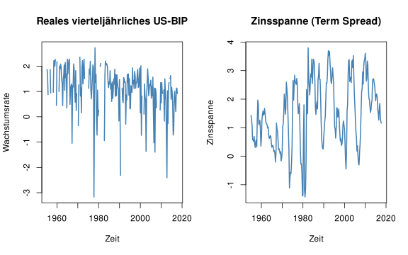

---

# Praxist-Teil Session 4:<br>Zusätzlichen Prädiktoren und das Autoregressive Distributed Lag (ADL) Modell

Dieses Dokument enthält den Praxis-Teil von Session 4: Zusätzlichen Prädiktoren und das Autoregressive Distributed Lag (ADL) Modell. 

---

## Setup


``` r
# Lade here Paket
library(here)

# Optionen Rendering
knitr::opts_knit$set(root.dir = here())
knitr::opts_chunk$set(echo = TRUE,
                      message = FALSE,
                      warning = FALSE,
                      fig.align = "center",
                      fig.cap = "",
                      fig.height = 5,
                      fig.width = 8)

# Säubere Umgebung
rm(list=ls())

# Lade Pakete
library(zoo)
library(dynlm)
library(sandwich)
library(lmtest)
```

---

## Datenaufbereitung

Einlesen der Daten.


``` r
us_macro <- read.table(here("04-session-01-04-adl-modelle", "01-daten", "us_macro_quarterly_merged.csv"),
                       header = TRUE,
                       sep = ";"
)
```

Umwandlung in ein `ts` Object.


``` r
us_macro_ts <- ts(
  us_macro,
  frequency = 4,
  start = c(1950, 1),
  end = c(2026, 1)
)

us_macro_ts <- window(us_macro_ts,
                      start = c(1955, 1),
                      end = c(2017, 4)
)
```

Berechnung der annualisierten Wachstumsrate.


``` r
GDP <- us_macro_ts[,"GDPC1"]
GDPGR <- 400 * log(GDP/lag(GDP, -1))
```

Berechnung der Zinsspanne.


``` r
TSpread <- us_macro_ts[,"GS10"] - us_macro_ts[,"TB3MS"]
```

Anbindung der annualisierten Wachstumsrate an `us_macro_ts`.


``` r
# Anbindung
us_macro_ts <- cbind(us_macro_ts, GDPGR, TSpread)

colnames(us_macro_ts) <- sub(".*\\.", "", colnames(us_macro_ts))
```

Darstellung der BIP Wachstumsrate und der Zinsspanne.


``` r
# Darstellung der BIP und Zinsspanne
par(mfrow = c(1,2))
plot(log(na.omit(us_macro_ts[,'GDPGR'])),
     col = "steelblue",
     lwd = 2,
     ylab = "Wachstumsrate",
     xlab = "Zeit",
     main = "Reales vierteljährliches US-BIP")
plot(na.omit(us_macro_ts[,'TSpread']),
     col = "steelblue",
     lwd = 2,
     ylab = "Zinsspanne",
     xlab = "Zeit",
     main = "Zinsspanne (Term Spread)")
```



---

### Frage 1

Diskutieren Sie kurz die Eigenschaften der Zinsspanne in Bezug auf "Stationarität" und in Bezug auf die Wachstumsrate des BIP.

...

...

...

...

...

---

## ADL(2,1) Modell: Schätzung

Schätzung eines ADL(2,1) Modells für 1962-Q1 - 2017-Q3


``` r
# Schätzung ADL(2,1) Model: 1962-Q1 - 2017-Q3
adl_0201_dynlm <- dynlm(GDPGR ~ L(GDPGR,1) + L(GDPGR,2) + L(TSpread,1),
                        data = us_macro_ts,
                        start = c(1962, 1), end = c(2017, 3))
                   
summary(adl_0201_dynlm)
```

```
## 
## Time series regression with "ts" data:
## Start = 1962(1), End = 2017(3)
## 
## Call:
## dynlm(formula = GDPGR ~ L(GDPGR, 1) + L(GDPGR, 2) + L(TSpread, 
##     1), data = us_macro_ts, start = c(1962, 1), end = c(2017, 
##     3))
## 
## Residuals:
##      Min       1Q   Median       3Q      Max 
## -10.3428  -1.6306  -0.1521   1.6320  13.2549 
## 
## Coefficients:
##               Estimate Std. Error t value Pr(>|t|)    
## (Intercept)    0.94082    0.39733   2.368  0.01876 *  
## L(GDPGR, 1)    0.26806    0.06546   4.095 5.95e-05 ***
## L(GDPGR, 2)    0.18975    0.06534   2.904  0.00406 ** 
## L(TSpread, 1)  0.42142    0.16626   2.535  0.01195 *  
## ---
## Signif. codes:  0 '***' 0.001 '**' 0.01 '*' 0.05 '.' 0.1 ' ' 1
## 
## Residual standard error: 2.976 on 219 degrees of freedom
##   (0 observations deleted due to missingness)
## Multiple R-squared:  0.1697,	Adjusted R-squared:  0.1583 
## F-statistic: 14.92 on 3 and 219 DF,  p-value: 7.14e-09
```

Tests der Koeffizienten:


``` r
# Tests
ct_adl_0201_dynlm <- coeftest(adl_0201_dynlm, vcov=vcovHC(adl_0201_dynlm, type="HC0"))
ct_adl_0201_dynlm
```

```
## 
## t test of coefficients:
## 
##               Estimate Std. Error t value  Pr(>|t|)    
## (Intercept)   0.940820   0.469447  2.0041 0.0462908 *  
## L(GDPGR, 1)   0.268057   0.079644  3.3657 0.0009016 ***
## L(GDPGR, 2)   0.189751   0.075616  2.5094 0.0128176 *  
## L(TSpread, 1) 0.421420   0.179841  2.3433 0.0200105 *  
## ---
## Signif. codes:  0 '***' 0.001 '**' 0.01 '*' 0.05 '.' 0.1 ' ' 1
```

---

### Frage 2

Was können wir von dem Ergebnis der Schätzung lernen?

...

...

...

...

...

---

### Frage 3

Was können wir von dem Ergebnis der Tests der Koeffizienten lernen?

...

...

...

...

...

---

## ADL(2,1) Modell Prognose

Verwendung des geschätzten ADL(2,1)-Modells zur Prognose.


``` r
# Daten für die Prognose 
X1 <- matrix(
  rev(window(us_macro_ts,start=c(2017,2),end=c(2017,3))[,c("TSpread", "GDPGR")])[-4],
  ncol=1
  )
XX <- round(rbind(1, X1),3)
# ADL(2,1) Koeffizienten
bet <- round(matrix(adl_0201_dynlm$coefficients,nrow=1),3)
# Prgnose für 2017 Q4
prog_erg <- bet %*% XX
prog_erg
```

```
##          [,1]
## [1,] 2.854483
```

``` r
# Tatsächlicher beobachteter Wert
tats_wert <- window(us_macro_ts[, "GDPGR"], start = c(2017, 4), end = c(2017, 4))
tats_wert
```

```
##          Qtr4
## 2017 2.504579
```

``` r
# Prognosefehler
prog_fehler <- tats_wert - prog_erg
prog_fehler
```

```
##            Qtr4
## 2017 -0.3499037
```

---

### Frage 4

Um welche Art von Prognose handelt es sich hier? Welche Schritte umfasst die Prognose basierend auf einem ADL(2,1) Modell? Wie würden Sie die Prognose bewerten?

...

...

...

...

...

---

## ADL(2,2) Modell: Schätzung

Schätzung eines ADL(2,2) Modells für 1962-Q1 - 2017-Q3


``` r
# Schätzung ADL(2,2) Model: 1962-Q1 - 2017-Q3
adl_0202_dynlm <- dynlm(GDPGR ~ L(GDPGR,1) + L(GDPGR,2) + L(TSpread,1) + L(TSpread,2),
                        data = us_macro_ts,
                        start = c(1962, 1), end = c(2017, 3))
                   
summary(adl_0202_dynlm)
```

```
## 
## Time series regression with "ts" data:
## Start = 1962(1), End = 2017(3)
## 
## Call:
## dynlm(formula = GDPGR ~ L(GDPGR, 1) + L(GDPGR, 2) + L(TSpread, 
##     1) + L(TSpread, 2), data = us_macro_ts, start = c(1962, 1), 
##     end = c(2017, 3))
## 
## Residuals:
##      Min       1Q   Median       3Q      Max 
## -10.4526  -1.6791  -0.1323   1.6031  13.2548 
## 
## Coefficients:
##               Estimate Std. Error t value Pr(>|t|)    
## (Intercept)    0.94375    0.39587   2.384 0.017982 *  
## L(GDPGR, 1)    0.24580    0.06665   3.688 0.000285 ***
## L(GDPGR, 2)    0.17574    0.06566   2.676 0.008008 ** 
## L(TSpread, 1) -0.12868    0.37733  -0.341 0.733401    
## L(TSpread, 2)  0.61751    0.38057   1.623 0.106121    
## ---
## Signif. codes:  0 '***' 0.001 '**' 0.01 '*' 0.05 '.' 0.1 ' ' 1
## 
## Residual standard error: 2.965 on 218 degrees of freedom
##   (0 observations deleted due to missingness)
## Multiple R-squared:  0.1796,	Adjusted R-squared:  0.1646 
## F-statistic: 11.93 on 4 and 218 DF,  p-value: 8.738e-09
```

Tests der Koeffizienten:


``` r
# Tests
ct_adl_0202_dynlm <- coeftest(adl_0202_dynlm, vcov=vcovHC(adl_0202_dynlm, type="HC0"))
ct_adl_0202_dynlm
```

```
## 
## t test of coefficients:
## 
##                Estimate Std. Error t value Pr(>|t|)   
## (Intercept)    0.943747   0.456779  2.0661 0.040002 * 
## L(GDPGR, 1)    0.245801   0.075135  3.2715 0.001244 **
## L(GDPGR, 2)    0.175742   0.075070  2.3410 0.020134 * 
## L(TSpread, 1) -0.128684   0.415056 -0.3100 0.756826   
## L(TSpread, 2)  0.617508   0.422872  1.4603 0.145655   
## ---
## Signif. codes:  0 '***' 0.001 '**' 0.01 '*' 0.05 '.' 0.1 ' ' 1
```

---

### Frage 5

Was können wir von dem Ergebnis der Schätzung lernen?

...

...

...

...

...

---

### Frage 6

Was können wir von dem Ergebnis der Tests der Koeffizienten lernen?


``` r
# install library (once)
#install.packages("car")
# load library (every session)
library(car)
# f-test based on heteroskedasticity-robust standard errors
lin.hyp <- linearHypothesis(adl_0202_dynlm, c("L(TSpread, 1)=0",
                                      "L(TSpread, 2)=0"), white.adjust = "hc1")
lin.hyp
```

```
## 
## Linear hypothesis test:
## L(TSpread,0
## L(TSpread, 2) = 0
## 
## Model 1: restricted model
## Model 2: GDPGR ~ L(GDPGR, 1) + L(GDPGR, 2) + L(TSpread, 1) + L(TSpread, 
##     2)
## 
## Note: Coefficient covariance matrix supplied.
## 
##   Res.Df Df      F  Pr(>F)  
## 1    220                    
## 2    218  2 3.9695 0.02026 *
## ---
## Signif. codes:  0 '***' 0.001 '**' 0.01 '*' 0.05 '.' 0.1 ' ' 1
```

...

...

...

...

...

---

## ADL(2,2) Modell Prognose

Verwendung des geschätzten ADL(2,2)-Modells zur Prognose.


``` r
# Daten für die Prognose 
X1 <- matrix(rev(
  window(us_macro_ts,start=c(2017,2),end=c(2017,3))[,c("TSpread", "GDPGR")]
  ),ncol=1)
XX <- round(rbind(1, X1),3)
# ADL(2,2) Koeffizienten
bet <- round(matrix(adl_0202_dynlm$coefficients,nrow=1),3)
# Prgnose für 2017 Q4
prog_erg <- bet %*% XX
prog_erg
```

```
##          [,1]
## [1,] 2.931597
```

``` r
# Tatsächlicher beobachteter Wert
tats_wert <- window(us_macro_ts[, "GDPGR"], start = c(2017, 4), end = c(2017, 4))
tats_wert
```

```
##          Qtr4
## 2017 2.504579
```

``` r
# Prognosefehler
prog_fehler <- tats_wert - prog_erg
prog_fehler
```

```
##            Qtr4
## 2017 -0.4270177
```

---

### Frage 7

Um welche Art von Prognose handelt es sich hier? Welche Schritte umfasst die Prognose basierend auf einem ADL(2,2) Modell? Wie würden Sie die Prognose bewerten?

...

...

...

...

...

---

### Frage 8

Vergleichen Sie die Prognosen basierend auf dem ADL(2,2) mit dem ADL(2,2) und dem AR(1) und AR(2) Modell.

...

...

...

...

...

---

### Frage 9

Diskutieren Sie die Kleinste-Quadrate-Annahmen für Prognosen mit mehreren Prädiktoren

...

...

...

...

...
