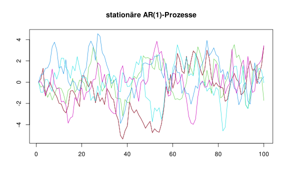
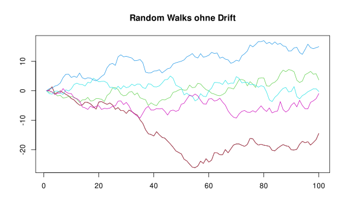
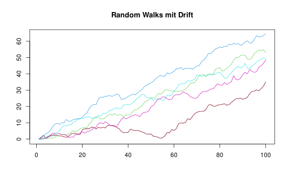
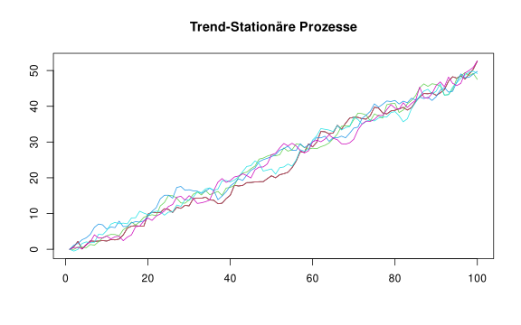
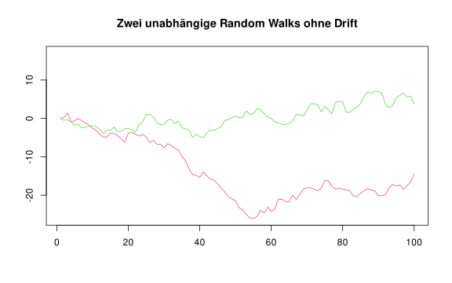
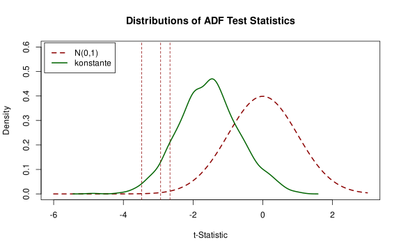
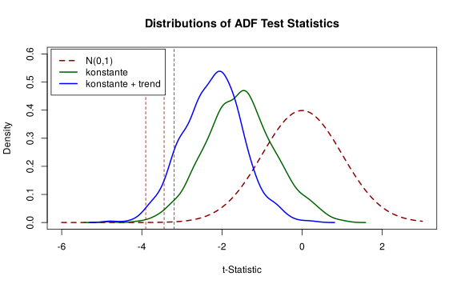

---
output:
  html_document
editor_options: 
  chunk_output_type: console
---

---

# Praxist-Teil Session 7:<br>Nicht-Stationarität I: Trends

Dieses Dokument enthält den Praxis-Teil von Session 7: Nicht-Stationarität I: Trends.

---

## Setup


``` r
# Lade here Paket
library(here)

# Optionen Rendering
knitr::opts_knit$set(root.dir = here())
knitr::opts_chunk$set(echo = TRUE,
                      message = FALSE,
                      warning = FALSE,
                      fig.align = "center",
                      fig.cap = "",
                      fig.height = 5,
                      fig.width = 8)

# Säubere Umgebung
rm(list=ls())

# Lade Pakete
library(zoo)
```

```
## 
## Attaching package: 'zoo'
```

```
## The following objects are masked from 'package:base':
## 
##     as.Date, as.Date.numeric
```

``` r
library(dynlm)
library(sandwich)
library(lmtest)
```

---

## Vorbereitung der Daten


``` r
#  "01-daten/us_macro_quarterly_merged.csv" -> "us_macro_ts" (data.frame)
source(here("07-session-01-07-trends", "02-code", "daten_vorbereitung_skript.R"))
```

---

## Arten von Trends

Simulation unterschiedlicher Modelle/Prozesse:

* Modell 1) Stationäre AR(1) Prozesse (kein Trend)
* Modell 2) Random Walks ohne Drift (Stochastische Trends)
* Modell 3) Random Walks mit Drift (Stochastische Trends)
* Modell 4) Trend-stationäre Prozesse (Deterministische Trends)

Funktion zur Simulation unterschiedlicher Modelle/Prozesse:


``` r
# function to simulate different processes
pro.sim.fun <- function(TT, y1, sig2, con, trend, ar1){
  eps <- matrix(-9999,TT,1)
  y <- matrix(-9999,TT,1)
  eps[1,1] <- rnorm(1, 0, sqrt(sig2))
  y[1,1] <- y1
  for (tt in 2:TT){
    eps[tt,1] <- rnorm(1, 0, sqrt(sig2))
    y[tt,1] <- con + trend * tt + ar1 * y[tt-1,1] + eps[tt,1]
  }
  ret.list <- list(y = y[1:TT,1], eps = eps[1:TT,1])
  return (ret.list)
}
```

**Modell 1) Stationäre AR(1) Prozesse (kein Trend)**


``` r
# simulate ensembles
TT <- 100
RR <- 5
set.seed(1234)
sim.01 <- matrix(-9999, TT, RR)
for (rr in 1:RR) {
  sim.01[,rr] <- pro.sim.fun(TT = TT, y1 = 0, sig2 = 1, con = 0, trend = 0, ar1 = 0.8)$y
}
```


``` r
# plot a ensemble trajectory
par(mfrow=c(1,1))
xaxis <- seq(1,TT)
plot(xaxis, sim.01[,1], type="l", ylab="", xlab="", main="stationäre AR(1)-Prozesse",
     ylim=c(min(sim.01),max(sim.01)))
for (rr in 1:RR){
  lines(xaxis, sim.01[,rr], type="l", col = rr + 1)
}
```



### Frage 1

Diskutieren kurz die Eigenschaften des simulierten Modells.

...

...

...

...

...

----

**Modell 2) Random Walks ohne Drift (Stochastische Trends)**


``` r
# simulate ensembles
TT <- 100
RR <- 5
set.seed(1234)
sim.02 <- matrix(-9999, TT, RR)
for (rr in 1:RR) {
  sim.02[,rr] <- pro.sim.fun(TT = TT, y1 = 0, sig2 = 1, con = 0, trend = 0, ar1 = 1)$y
}
```


``` r
# plot a ensemble trajectory
par(mfrow=c(1,1))
xaxis <- seq(1,TT)
plot(xaxis, sim.02[,1], type="l", ylab="", xlab="", main="Random Walks ohne Drift",
     ylim=c(min(sim.02),max(sim.02)))
for (rr in 1:RR){
  lines(xaxis, sim.02[,rr], type="l", col = rr + 1)
}
```



### Frage 2

Diskutieren kurz die Eigenschaften des simulierten Modells.

...

...

...

...

...

----

**Modell 3) Random Walks mit Drift (Stochastische Trends)**


``` r
# simulate ensembles
TT <- 100
RR <- 5
set.seed(1234)
sim.03 <- matrix(-9999, TT, RR)
for (rr in 1:RR) {
  sim.03[,rr] <- pro.sim.fun(TT = TT, y1 = 0, sig2 = 1, con = 0.5, trend = 0, ar1 = 1)$y
}
```


``` r
# plot a ensemble trajectory
par(mfrow=c(1,1))
xaxis <- seq(1,TT)
plot(xaxis, sim.03[,1], type="l", ylab="", xlab="", main="Random Walks mit Drift",
     ylim=c(min(sim.03),max(sim.03)))
for (rr in 1:RR){
  lines(xaxis, sim.03[,rr], type="l", col = rr + 1)
}
```



### Frage 3

Diskutieren kurz die Eigenschaften des simulierten Modells.

...

...

...

...

...

----

**Modell 4) Trend-stationäre Prozesse (Deterministische Trends)**


``` r
# simulate ensembles
TT <- 100
RR <- 5
set.seed(1234)
sim.04 <- matrix(-9999, TT, RR)
for (rr in 1:RR) {
  sim.04[,rr] <- pro.sim.fun(TT = TT, y1 = 0, sig2 = 1, con = 0.25, trend = 0.1, ar1 = 0.8)$y
}
```


``` r
# plot a ensemble trajectory
par(mfrow=c(1,1))
xaxis <- seq(1,TT)
plot(xaxis, sim.04[,1], type="l", ylab="", xlab="", main="Trend-Stationäre Prozesse",
     ylim=c(min(sim.04),max(sim.04)))
for (rr in 1:RR){
  lines(xaxis, sim.04[,rr], type="l", col = rr + 1)
}
```



### Frage 4

Diskutieren kurz die Eigenschaften des simulierten Modells.

...

...

...

...

...

----

## Probleme aufgrund von stochastischen Trends


``` r
# Spurious Regression
plot(xaxis, sim.02[,1], type="l", col = 2, ylab="", xlab="",
     main="Zwei unabhängige Random Walks ohne Drift",
     ylim=c(min(sim.02),max(sim.02)))
lines(xaxis,sim.02[,2], type="l", col = 3)
```



``` r
yt <- as.ts(sim.02[,1])
xt <- as.ts(sim.02[,2])

est.res <- dynlm(yt ~ L(xt))

coeftest(est.res, vcov=vcovHC(est.res, type="HC0"))
```

```
## 
## t test of coefficients:
## 
##              Estimate Std. Error  t value  Pr(>|t|)    
## (Intercept) -13.65762    0.70560 -19.3561 < 2.2e-16 ***
## L(xt)        -1.18931    0.15613  -7.6173  1.73e-11 ***
## ---
## Signif. codes:  0 '***' 0.001 '**' 0.01 '*' 0.05 '.' 0.1 ' ' 1
```

### Frage 5

Welche Probleme ergeben sich aufgrund von Trends? Worum handelt es sich beim Problem der "Spurious Regression"?

...

...

...

...

...
  
----

## Trend Erkennung 

**Kritische Werte**

Fall 1: Stochastischer Trend ohne Drift


``` r
# simulate ensembles
TT <- 100
RR <- 1000
set.seed(1234)
sim.05 <- matrix(-9999, TT, RR)
stat.01 <- matrix(-9999, RR, 1)
for (rr in 1:RR) {
  sim.05[,rr] <- pro.sim.fun(TT = TT, y1 = 0, sig2 = 1, con = 0, trend = 0, ar1 = 1)$y
  yt <- as.ts(sim.05[,rr])
  est.res <- dynlm(diff(yt, 1) ~ L(yt, 1) + 1)
  stat.01[rr, 1] <- summary(est.res)$coefficients[2,3]
}

crit.01 <- round(quantile(stat.01[, 1], c(0.1, 0.05, 0.01)), 3)
crit.01
```

```
##    10%     5%     1% 
## -2.663 -2.931 -3.473
```


``` r
# plot standard normal density
curve(dnorm(x), 
      from = -6, to = 3, 
      ylim = c(0, 0.6), 
      lty = 2,
      ylab = "Density",
      xlab = "t-Statistic",
      main = "Distributions of ADF Test Statistics",
      col = "darkred", 
      lwd = 2)

# plot density estimates of both Dickey-Fuller distributions
lines(density(stat.01[, 1]), lwd = 2, col = "darkgreen")

# plot quantiles
abline(v = crit.01[1], lty = 2, lwd = 1, col = "darkred")
abline(v = crit.01[2], lty = 2, lwd = 1, col = "darkred")
abline(v = crit.01[3], lty = 2, lwd = 1, col = "darkred")

# add a legend
legend("topleft", 
       c("N(0,1)", "konstante"),
       col = c("darkred", "darkgreen"),
       lty = c(2, 1),
       lwd = 2,
       inset=.01)
```



### Frage 6

Interpretieren Sie das Ergebnis der Simulation. Was ist die Null-Hypothese? Um welche Spezifikation der DF-Testregression handelt es sich? Was ist das Problem mit der Teststatistik?

...

...

...

...

...

----

Fall 2: Stochastischer Trend mit Drift 


``` r
# simulate ensembles
TT <- 1000
RR <- 1000
set.seed(1234)
sim.06 <- matrix(-9999, TT, RR)
stat.02 <- matrix(-9999, RR, 1)
for (rr in 1:RR) {
  sim.06[,rr] <- pro.sim.fun(TT = TT, y1 = 0, sig2 = 1, con = 0.5, trend = 0, ar1 = 1)$y
  yt <- as.ts(sim.06[,rr])
  est.res <- dynlm(diff(yt, 1) ~ L(yt, 1) + trend(yt) + 1)
  stat.02[rr, 1] <- summary(est.res)$coefficients[2,3]
}

crit.02 <- round(quantile(stat.02[, 1], c(0.1, 0.05, 0.01)), 3)
crit.02
```

```
##    10%     5%     1% 
## -3.192 -3.444 -3.903
```


``` r
# plot standard normal density
curve(dnorm(x), 
      from = -6, to = 3, 
      ylim = c(0, 0.6), 
      lty = 2,
      ylab = "Density",
      xlab = "t-Statistic",
      main = "Distributions of ADF Test Statistics",
      col = "darkred", 
      lwd = 2)

# plot density estimates of both Dickey-Fuller distributions
lines(density(stat.01[,1]), lwd = 2, col = "darkgreen")
lines(density(stat.02[,1]), lwd = 2, col = "blue")

# plot quantiles
abline(v = crit.02[1], lty = 2, lwd = 1, col = "darkred")
abline(v = crit.02[2], lty = 2, lwd = 1, col = "darkred")
abline(v = crit.02[3], lty = 2, lwd = 1, col = "darkred")

# add a legend
legend("topleft", 
       c("N(0,1)", "konstante", "konstante + trend"),
       col = c("darkred", "darkgreen", "blue"),
       lty = c(2, 1, 1),
       lwd = 2,
       inset=.01)
```



### Frage 7

Interpretieren Sie das Ergebnis der Simulation. Was ist die Null-Hypothese? Um welche Spezifikation der DF-Testregression handelt es sich? Was ist das Problem mit der Teststatistik?

...

...

...

...

...

----

**US BIP Beispiel**


``` r
# Basierend auf urca
library(urca)
LGDP.win <- window(LGDP, start = c(1961,2), end = c(2017,3))

ur.reg.01 <- ur.df(y = LGDP.win, type = "trend", lags = 2)
summary(ur.reg.01)
```

```
## 
## ############################################### 
## # Augmented Dickey-Fuller Test Unit Root Test # 
## ############################################### 
## 
## Test regression trend 
## 
## 
## Call:
## lm(formula = z.diff ~ z.lag.1 + 1 + tt + z.diff.lag)
## 
## Residuals:
##       Min        1Q    Median        3Q       Max 
## -0.026027 -0.003979  0.000285  0.004543  0.032476 
## 
## Coefficients:
##               Estimate Std. Error t value Pr(>|t|)    
## (Intercept)  0.1641769  0.0808787   2.030 0.043580 *  
## z.lag.1     -0.0193067  0.0098788  -1.954 0.051937 .  
## tt           0.0001272  0.0000736   1.729 0.085286 .  
## z.diff.lag1  0.2610448  0.0662197   3.942 0.000109 ***
## z.diff.lag2  0.1649418  0.0663905   2.484 0.013729 *  
## ---
## Signif. codes:  0 '***' 0.001 '**' 0.01 '*' 0.05 '.' 0.1 ' ' 1
## 
## Residual standard error: 0.007438 on 218 degrees of freedom
## Multiple R-squared:  0.1742,	Adjusted R-squared:  0.159 
## F-statistic: 11.49 on 4 and 218 DF,  p-value: 1.746e-08
## 
## 
## Value of test-statistic is: -1.9544 12.0917 3.8034 
## 
## Critical values for test statistics: 
##       1pct  5pct 10pct
## tau3 -3.99 -3.43 -3.13
## phi2  6.22  4.75  4.07
## phi3  8.43  6.49  5.47
```

``` r
# Basierend auf dynlm
ur.reg.02 <- dynlm(LGDPDIF ~ L(LGDP,1) + L(LGDPDIF,1) + L(LGDPDIF,2) + trend(LGDPDIF),
             data = us_macro_ts,
             start = c(1962, 1), end = c(2017, 3))
summary(ur.reg.02)
```

```
## 
## Time series regression with "ts" data:
## Start = 1962(1), End = 2017(3)
## 
## Call:
## dynlm(formula = LGDPDIF ~ L(LGDP, 1) + L(LGDPDIF, 1) + L(LGDPDIF, 
##     2) + trend(LGDPDIF), data = us_macro_ts, start = c(1962, 
##     1), end = c(2017, 3))
## 
## Residuals:
##       Min        1Q    Median        3Q       Max 
## -0.026027 -0.003979  0.000285  0.004543  0.032476 
## 
## Coefficients:
##                  Estimate Std. Error t value Pr(>|t|)    
## (Intercept)     0.1608692  0.0789803   2.037 0.042876 *  
## L(LGDP, 1)     -0.0193067  0.0098788  -1.954 0.051937 .  
## L(LGDPDIF, 1)   0.2610448  0.0662197   3.942 0.000109 ***
## L(LGDPDIF, 2)   0.1649418  0.0663905   2.484 0.013729 *  
## trend(LGDPDIF)  0.0005089  0.0002944   1.729 0.085286 .  
## ---
## Signif. codes:  0 '***' 0.001 '**' 0.01 '*' 0.05 '.' 0.1 ' ' 1
## 
## Residual standard error: 0.007438 on 218 degrees of freedom
##   (0 observations deleted due to missingness)
## Multiple R-squared:  0.1742,	Adjusted R-squared:  0.159 
## F-statistic: 11.49 on 4 and 218 DF,  p-value: 1.746e-08
```


### Frage 8

Interpretieren Sie das Ergebnis der DF-Tests. Was ist die Null-Hypothese? Um welche Spezifikation der DF-Testregression handelt es sich? Was ist die Schlussfolgerung?

...

...

...

...

...
