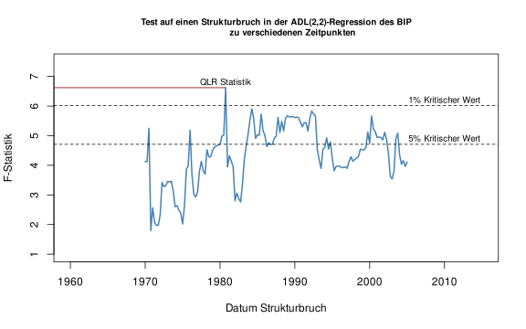
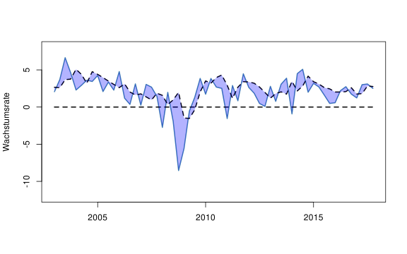
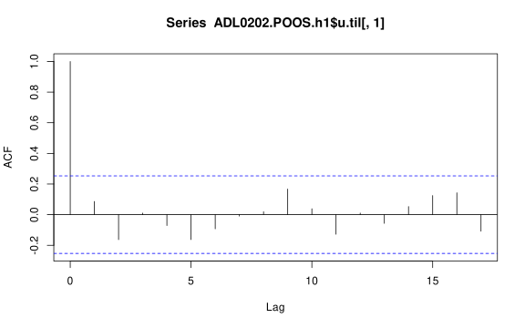
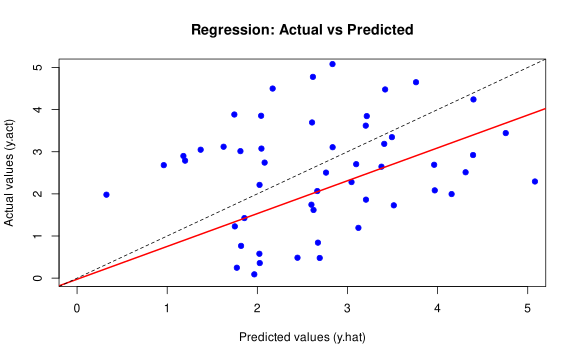
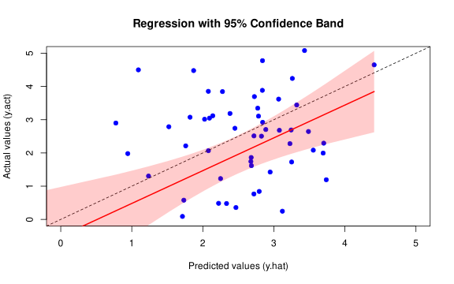
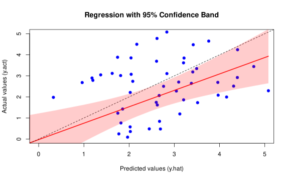

---
output:
  html_document
editor_options:
  chunk_output_type: console
---

---

# Praxist-Teil Session 8:<br>Nicht-Stationarität II: Strukturbrüche

Dieses Dokument enthält den Praxis-Teil von Session 8: Nicht-Stationarität II: Strukturbrüche.

---

# Setup


``` r
# Lade here Paket
library(here)

# Optionen Rendering
knitr::opts_knit$set(root.dir = here())
knitr::opts_chunk$set(echo = TRUE,
                      message = FALSE,
                      warning = FALSE,
                      fig.align = "center",
                      fig.cap = "",
                      fig.height = 5,
                      fig.width = 8)

# Säubere Umgebung
rm(list=ls())

# Lade Pakete
library(zoo)
library(dynlm)
library(sandwich)
library(lmtest)
library(AER)
```

```
## Loading required package: car
```

```
## Loading required package: carData
```

```
## Loading required package: survival
```

``` r
library(scales)
```

---

## Vorbereitung der Daten


``` r
#  "01-daten/us_macro_quarterly_merged.csv" -> "us_macro_ts" (data.frame)
source(here("08-session-01-08-strukturbrueche", "02-code", "daten_vorbereitung_skript.R"))
```

---

## Test auf Strukturbrüche


``` r
# Vorbereitungen
tau <- seq(1970, 2005, 0.25)
ser <- us_macro_ts[,"GDPGR"]

f.stat <- matrix(-9999, length(tau), 1)

# Schleife mit Schätzungen und Berechnungen von F-Statistiken
for (ii in 1:length(tau)) {
  
  D <- time(ser) > tau[ii]
  
  # Schätze ADL(2,2) Model mit Interaktionen
  tmp.reg <- dynlm(GDPGR ~ L(GDPGR, 1) + L(GDPGR, 2) + 
                   D*L(TSpread, 1) + D*L(TSpread, 2),
                   data = us_macro_ts,
                   start = c(1962, 1), 
                   end = c(2012, 4))
  
  # Berechne und sammle F-Statistiken
  f.stat[ii] <- linearHypothesis(tmp.reg,
                                c("DTRUE=0",
                                  "DTRUE:L(TSpread, 1)",
                                  "DTRUE:L(TSpread, 2)"),
                                vcov=vcovHC(tmp.reg, type="HC0"))$F[2]

}

# QLR Statistik
QLR <- max(f.stat)
QLR
```

```
## [1] 6.621616
```

``` r
# Zeitperiode für die diese QLR-statistic beobachtet wird
as.yearqtr(tau[which.max(f.stat)])
```

```
## [1] "1980 Q4"
```

### Frage 1

Interpretieren Sie das Ergebnis des Tests auf Strukturbrüche oben. Spezifizieren Sie dafür das Strukturbruchmodell. Welche Schlussfolgerungen ziehen Sie aus dem Ergebnisse?

...

...

...

...
   
...

---


``` r
# F-Statistiken
f.stat.ts <- ts(f.stat, 
                   start = tau[1], 
                   end = tau[length(tau)], 
                   frequency = 4)

# Illustration F-Statistiken 
plot(f.stat.ts, 
     xlim = c(1960, 2015),
     ylim = c(1, 7.5),
     lwd = 2,
     col = "steelblue",
     ylab = "F-Statistik",
     xlab = "Datum Strukturbruch",
     main = "Test auf einen Strukturbruch in der ADL(2,2)-Regression des BIP
            zu verschiedenen Zeitpunkten",
     cex.main=0.8)

# Kritische Werte und QLR Statistik
abline(h = 4.71, lty = 2)
abline(h = 6.02, lty = 2)
segments(0, QLR, 1980.75, QLR, col = "darkred")
text(2010, 6.2, "1% Kritischer Wert",cex=0.8)
text(2010, 4.9, "5% Kritischer Wert",cex=0.8)
text(1980.75, QLR+0.2, "QLR Statistik",cex=0.8)
```



### Frage 2

Was wird anhand der Grafik oben dargestellt? Interpretieren Sie das Ergebnis.

...

...

...

...

...

---

## Erkennen von Strukturbrüchen mit POOS Prognosen

Funktionen für die POOS Analyse (siehe auch letzte Veranstaltung):


``` r
# R helper function data preparation 1
lag_fun <- function(x, lag) {
  
  if (lag >= 1) {
    c(rep(NA, lag), x[-seq(length(x), length(x)-lag+1)])
  } else {
    c(x[-seq(1, -lag)], rep(NA, -lag))
  }
  
}

# function for poos for observed variables and unobserved factor models
POOS_function <- function(date.df, data.01, data.02, h, fre,
                               all.per.sta, all.per.end,
                               est.per.sta, est.per.end,
                               pre.per.sta, pre.per.end,
                               print = FALSE, log.file = NULL) {
  
  # 1) Prepare data ----
  
  # variable names
  data.01.nam <- colnames(data.01)
  data.02.nam <- colnames(data.02)
  
  # collect all data
  data <- cbind(data.01, data.02)
  tmp <- c(data.01.nam, data.02.nam)
  ii <- which(colnames(data) %in% tmp)
  data <- data[,ii]
    
  # 2) Prepare periods and POOS-analysis-index-s (see S&W, 2020, p. 575) ----
  
  # complete period
  all.per <- seq.Date(from = all.per.sta, to = all.per.end, by = fre)
  # estimation period
  est.per <- seq.Date(from = est.per.sta, to = est.per.end, by = fre)
  # prediction period
  pre.per <- seq.Date(from = pre.per.sta, to = pre.per.end, by = fre)
  
  # starting index for estimation/prediction
  est.sta <- which(all.per %in% est.per.sta)
  pre.sta <- which(all.per %in% pre.per.sta)
  
  # starting index for s
  s.ii.00 <- which(all.per %in% pre.per.sta)
  s.ii.00.h <- s.ii.00 - h
  
  # ending index of s
  s.ii.TT <- which(all.per %in% pre.per.end)
  s.ii.TT.h <- s.ii.TT - h
  
  s.ii.seq.h <- seq(s.ii.00.h, s.ii.TT.h)
  
  pre.sta <- pre.sta - 1
  
  # 3) POOS-analysis ----
  
  y.hat <- matrix(NA, nrow = length(s.ii.seq.h))
  y.act <- matrix(NA, nrow = length(s.ii.seq.h))
  u.til <- matrix(NA, nrow = length(s.ii.seq.h))
  
  for (tt in 1:length(s.ii.seq.h)) {
    
    # moving POOS-analysis-index-s
    s.ii <- s.ii.seq.h[tt]
    
    # extract data for estimation
    est.dat.tmp <- data[which(date.df$date %in% seq.Date(
      from = all.per[est.sta], to = all.per[s.ii], by = fre)),]
    
    # construct formula
    formula <- as.formula(paste(paste0(data.01.nam, " ~ "),
                                paste(data.02.nam, collapse = " + "), " - 1"))
    
    # estimate model
    coef.tmp <- lm(formula = formula, data = est.dat.tmp)$coefficients
    
    # extract data for prediction Y
    y.pre.dat.tmp <- data[which(date.df$date == all.per[pre.sta + tt]), data.01.nam]
    y.act[tt] <- as.numeric(y.pre.dat.tmp)
    
    # extract data for prediction X
    X.pre.dat.tmp <- data[which(date.df$date == all.per[pre.sta + tt]), data.02.nam]
    
    # predict y
    y.hat[tt] <- as.numeric(matrix(coef.tmp, nrow = 1)) %*% 
      as.numeric(matrix(X.pre.dat.tmp, ncol = 1))
    # evaluate prediction
    u.til[tt] <- y.act[tt] - y.hat[tt]
    
    if (print == TRUE) {
      if (!is.null(log.file)) {
        sink(log.file, append = TRUE)
      }
      
      # print for diagnostics
      cat("--------------------------------------------------", "\n")
      cat(paste0("Step ", tt, " from ", length(s.ii.seq.h), "\n"))
      cat(paste0("   Estimation: From ", as.Date(all.per[est.sta]), " to ", 
                 as.Date(all.per[s.ii]), "\n"))
      cat(paste0("   Prediction: For ", as.Date(all.per[pre.sta + tt]), "\n"))
      
      cat(paste0("  Y: ", y.pre.dat.tmp, "\n"))
      cat(paste0("  b: ", coef.tmp, "\n"))
      cat(paste0("  b (name): ", names(coef.tmp), "\n"))
      cat(paste0("  X: ", X.pre.dat.tmp, "\n"))
      cat(paste0("  Y (hat): ", y.hat[tt], "\n"))
      cat(paste0("  u (til): ", u.til[tt], "\n"))
      
      if (!is.null(log.file)) {
        sink()  # return output to console
      }
    }    
    
  }
  
  # 4) POOS-analysis-results ----
  
  MSFE.POOS <- 1/length(u.til[-seq(1,h),]) * sum(u.til[-seq(1,h),]^2)
  
  RMSFE.POOS <- sqrt(MSFE.POOS)
  
  # returns
  ret.lis <- list(MSFE.POOS = MSFE.POOS,
                  RMSFE.POOS = RMSFE.POOS,
                  data = data,
                  y.act = y.act,
                  y.hat = y.hat,
                  u.til = u.til)
  
  return(ret.lis)
  
}
```

Vorbereitung der POOS Analyse (siehe auch letzte Veranstaltung):


``` r
# Preparations
data.all.ts <- us_macro_ts

# extract time period of interest
data.all.ts <- window(data.all.ts, start = c(1959, 3), end = c(2017, 4))
# corresponding date
date <- seq.Date(from = as.Date("1959-07-01"), to = as.Date("2017-10-01"), by = "quarter")

# dates data frame (date column is important!)
date.df <- data.frame(date = date,
                      year = format(date, "%Y"),
                      quarter = quarters(date),
                      month = format(date, "%m"),
                      day = format(date, "%d"))

# target variable (data frame)
GDP <- as.numeric(data.all.ts[,4])
h <- 1

data.01 <- data.frame(GDPGR_h = (400/h) * (log(GDP / lag_fun(GDP, h))))

# other inputs
h <- 1
fre <- "quarter"
all.per.sta <- as.Date("1962-01-01") # 1962-Q1 -> 2017-Q4
all.per.end <- as.Date("2017-10-01")
est.per.sta <- as.Date("1981-01-01")
est.per.end <- as.Date("2002-10-01") 
pre.per.sta <- as.Date("2003-01-01") 
pre.per.end <- as.Date("2017-10-01")
print <- TRUE
```

Analyse des ADL(2,2)-Modells (siehe auch letzte Veranstaltung):


``` r
# additional variable (data frame)
TSpread <- as.numeric(data.all.ts[,20])

# observed predictors (variables) (data frame)
data.02 <- data.frame(GDPGR_h_l1 = lag_fun(log(GDP / lag_fun(GDP, 1)), h),
                      GDPGR_h_l2 = lag_fun(log(GDP / lag_fun(GDP, 1)), h + 1),
                      TSpread_h_l1 = lag_fun(TSpread, h),
                      TSpread_h_l2 = lag_fun(TSpread, h + 1),
                      CONST = 1)

log.file <- here("08-session-01-08-strukturbrueche", "03-ergebnisse", "adl_0202_poos_diagnosen.txt")

ADL0202.POOS.h1 <- POOS_function(date.df = date.df, data.01 = data.01, data.02 = data.02,
                                 h = 1, fre = "quarter",
                                 all.per.sta = all.per.sta, all.per.end = all.per.end,
                                 est.per.sta = est.per.sta, est.per.end = est.per.end,
                                 pre.per.sta = pre.per.sta, pre.per.end = pre.per.end,
                                 print = TRUE, log.file = log.file)
(adl_0202_rmsfe_poos <- ADL0202.POOS.h1$RMSFE.POOS)
```

```
## [1] 2.303615
```

Vergleich der POOS Prognosen und der tatsächlichen Werte:


``` r
# Create date sequence
date_seq <- seq.Date(from = as.Date("2003-01-01"), to = as.Date("2017-10-01"), by = "quarter")

# Plot actual data
plot(date_seq, ADL0202.POOS.h1$y.act[,1],
     type = "l",
     col = "steelblue",
     lwd = 2,
     ylim = c(-12, 8),
     xlab = "",
     ylab = "Wachstumsrate")

# Add fitted values
lines(date_seq, ADL0202.POOS.h1$y.hat[,1],
      lwd = 2,
      lty = 2)
lines(date_seq, rep(0, length(date_seq)),
      lwd = 2,
      lty = 2)

# Draw polygon between actual and fitted values
polygon(
  x = c(date_seq, rev(date_seq)),
  y = c(ADL0202.POOS.h1$y.act[,1], rev(ADL0202.POOS.h1$y.hat[,1])),
  col = alpha("blue", 0.3),
  border = NA
)
```



### Frage 3

Was wird anhand der Grafik oben dargestellt? Interpretieren Sie das Ergebnis.

...

...

...

...

...

---

Analyse der POOS Prognosefehler (out-of-sample)


``` r
# Regressionsanalyse basierend auf POOS Prognosen
reg.01 <- lm(ADL0202.POOS.h1$u.til[,1] ~ 1)

summary(reg.01)
```

```
## 
## Call:
## lm(formula = ADL0202.POOS.h1$u.til[, 1] ~ 1)
## 
## Residuals:
##     Min      1Q  Median      3Q     Max 
## -9.9461 -1.2144  0.0981  1.6417  3.5295 
## 
## Coefficients:
##             Estimate Std. Error t value Pr(>|t|)  
## (Intercept)  -0.5749     0.2880  -1.996   0.0505 .
## ---
## Signif. codes:  0 '***' 0.001 '**' 0.01 '*' 0.05 '.' 0.1 ' ' 1
## 
## Residual standard error: 2.231 on 59 degrees of freedom
```

### Frage 4

Was können Sie aus der Regressionsanalyse basierend auf den POOS Prognosen oben lernen? Diskutieren Sie das Ergebnis im Zusammenhang mit unseren Annahmen für "gute" Prognosen die wir bereits im Kurs besprochen haben.

...

...

...

...

...

---
    

``` r
# Check autokorrelation
acf(ADL0202.POOS.h1$u.til[,1])
```




``` r
lm.res <- lm(ADL0202.POOS.h1$y.act ~ ADL0202.POOS.h1$y.hat)
summary(lm.res)
```

```
## 
## Call:
## lm(formula = ADL0202.POOS.h1$y.act ~ ADL0202.POOS.h1$y.hat)
## 
## Residuals:
##      Min       1Q   Median       3Q      Max 
## -10.0584  -1.0158   0.0273   1.6427   3.7947 
## 
## Coefficients:
##                       Estimate Std. Error t value Pr(>|t|)    
## (Intercept)           -0.02592    0.62109  -0.042  0.96685    
## ADL0202.POOS.h1$y.hat  0.77930    0.22121   3.523  0.00084 ***
## ---
## Signif. codes:  0 '***' 0.001 '**' 0.01 '*' 0.05 '.' 0.1 ' ' 1
## 
## Residual standard error: 2.231 on 58 degrees of freedom
## Multiple R-squared:  0.1763,	Adjusted R-squared:  0.1621 
## F-statistic: 12.41 on 1 and 58 DF,  p-value: 0.0008399
```

``` r
# Plot the actual vs predicted values
plot(ADL0202.POOS.h1$y.hat, ADL0202.POOS.h1$y.act,
     xlab = "Predicted values (y.hat)",
     ylab = "Actual values (y.act)",
     main = "Regression: Actual vs Predicted",
     pch = 19, col = "blue",
     xlim = c(0, 5), ylim = c(0, 5))

# Add the regression line
abline(lm.res, col = "red", lwd = 2)
abline(0, 1, col = "black", lty = 2)  # y = x line
```



``` r
linearHypothesis(lm.res, c("(Intercept) = 0", "ADL0202.POOS.h1$y.hat = 1"))
```

```
## 
## Linear hypothesis test:
## (Intercept) = 0
## ADL0202.POOS.h1$y.hat = 1
## 
## Model 1: restricted model
## Model 2: ADL0202.POOS.h1$y.act ~ ADL0202.POOS.h1$y.hat
## 
##   Res.Df    RSS Df Sum of Sq      F  Pr(>F)  
## 1     60 313.45                              
## 2     58 288.66  2    24.786 2.4901 0.09173 .
## ---
## Signif. codes:  0 '***' 0.001 '**' 0.01 '*' 0.05 '.' 0.1 ' ' 1
```

...

...

...

...

...

---

MSFE Vergleich: In-Sample vs. out-of-Sample


``` r
# Schätzung ADL(2,2) Model: 1962-Q1 - 2017-Q3
adl_0202_dynlm <- dynlm(GDPGR ~ L(GDPGR,1) + L(GDPGR,2) + L(TSpread,1) + L(TSpread,2),
                        data = us_macro_ts,
                        start = c(1981, 1), end = c(2002, 4))

# In-sample RMSFE basierend auf FPE
(adl_0202_rmsfe_fpe <- sqrt(
  (nrow(adl_0202_dynlm$model) + 
    length(adl_0202_dynlm$coefficients)) / 
    (nrow(adl_0202_dynlm$model) - length(adl_0202_dynlm$coefficients)) *
    sum(adl_0202_dynlm$residuals^2) / nrow(adl_0202_dynlm$model))
)
```

```
## [1] 2.454775
```

``` r
# Out-of-sample RMSFE basierend auf POOS
adl_0202_rmsfe_poos
```

```
## [1] 2.303615
```

### Frage 5

Was können Sie aus dem Vergleich des RMSFEs in-sample basierend auf FPE und des RMSFEs out-of-sample basierend auf der POOS-Analyse lernen?

Zurück zum Strukturbruchthema (nach einem kleinen Exkurs in "Forecasting Evaluation"!)

...

...

...

...

...

---

## Umgang mit be- oder erkannten Strukturbrüchen


``` r
# POOS Felher ohne 2008-Q4
u.til.adj <- ADL0202.POOS.h1$u.til[-c(24),]

MSFE.POOS.adj <- 1/length(u.til.adj) * sum(u.til.adj^2)
RMSFE.POOS.adj <- sqrt(MSFE.POOS.adj)
RMSFE.POOS.adj
```

```
## [1] 1.853803
```

### Frage 6

Erläutern Sie den Umgang mit einem potentiellen Strukturbruch oben. Interpretieren Sie das Ergebnis.

...

...

...

...

...

---

## Analyse der POOS Residuen

**POOS Analyse AR(1)-Modell**


``` r
# observed predictors (variables) (data frame)
data.02 <- data.frame(GDPGR_h_l1 = lag_fun(log(GDP / lag_fun(GDP, 1)), h),
                      CONST = 1)

log.file <- here("08-session-01-08-strukturbrueche", "03-ergebnisse", "ar_01_poos_diagnosen.txt")

AR1.POOS.h1 <- POOS_function(date.df = date.df, data.01 = data.01, data.02 = data.02,
                             h = 1, fre = "quarter",
                             all.per.sta = all.per.sta, all.per.end = all.per.end,
                             est.per.sta = est.per.sta, est.per.end = est.per.end,
                             pre.per.sta = pre.per.sta, pre.per.end = pre.per.end,
                             print = TRUE, log.file = log.file)
(ar_01_rmsfe_poos <- AR1.POOS.h1$RMSFE.POOS)
```

```
## [1] 2.271502
```

**Mincer-Zarnowitz Regression: AR(1)-Modell**


``` r
# Fit model
lm.res <- lm(AR1.POOS.h1$y.act ~ AR1.POOS.h1$y.hat)

# Extract x values
x <- AR1.POOS.h1$y.hat

# Create prediction with confidence intervals
pred <- predict(lm.res, interval = "confidence")

# Base scatter plot
plot(x, AR1.POOS.h1$y.act,
     xlab = "Predicted values (y.hat)",
     ylab = "Actual values (y.act)",
     main = "Regression with 95% Confidence Band",
     xlim = c(0, 5), ylim = c(0, 5),
     pch = 19, col = "blue")

# Add regression line
lines(x[order(x)], pred[order(x), "fit"], col = "red", lwd = 2)
abline(0, 1, col = "black", lty = 2)  # y = x line

# Add confidence band
polygon(c(x[order(x)], rev(x[order(x)])),
        c(pred[order(x), "lwr"], rev(pred[order(x), "upr"])),
        col = rgb(1, 0, 0, alpha = 0.2), border = NA)
```



**Mincer-Zarnowitz Regression: ADL(2,2)-Modell**


``` r
# Fit model
lm.res <- lm(ADL0202.POOS.h1$y.act ~ ADL0202.POOS.h1$y.hat)

# Extract x values
x <- ADL0202.POOS.h1$y.hat

# Create prediction with confidence intervals
pred <- predict(lm.res, interval = "confidence")

# Base scatter plot
plot(x, ADL0202.POOS.h1$y.act,
     xlab = "Predicted values (y.hat)",
     ylab = "Actual values (y.act)",
     main = "Regression with 95% Confidence Band",
     xlim = c(0, 5), ylim = c(0, 5),
     pch = 19, col = "blue")

# Add regression line
lines(x[order(x)], pred[order(x), "fit"], col = "red", lwd = 2)
abline(0, 1, col = "black", lty = 2)  # y = x line

# Add confidence band
polygon(c(x[order(x)], rev(x[order(x)])),
        c(pred[order(x), "lwr"], rev(pred[order(x), "upr"])),
        col = rgb(1, 0, 0, alpha = 0.2), border = NA)
```



---

### Frage 7

Interpretieren Sie das Ergebnis der Analyse der POOS Residuen oben.

...

...

...

...

...
